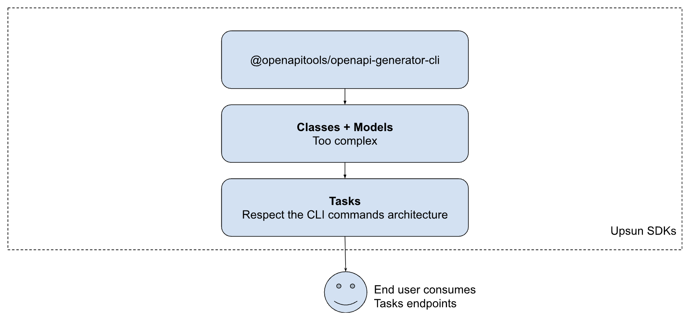

> [!CAUTION]
> **This project is owned by the Upsun Advocacy team. It is in an early stage of development [experimental] and should be used with caution by Upsun customers/community. <br /><br />
> This project is not officially supported by Upsun and does not fall under any Support plans. Use this repository at your own risk — it is provided without guarantees or warranties!**
>
> Don’t hesitate to join our [Discord](https://discord.com/invite/platformsh) to share your thoughts about this project.

# Upsun SDK PHP

The official **Upsun SDK for PHP**. This SDK provides a PHP interface that maps to the Upsun CLI commands. 
For more information, read [the documentation](https://docs.upsun.com).

## Installation

Install the SDK via Composer:

```bash
composer require Upsun/
```

Then include Composer's autoloader in your PHP application:

```php
require __DIR__ . '/vendor/autoload.php';
```

## Authentication

You will need an [Upsun API token](https://docs.upsun.com/administration/cli/api-tokens.html) to use this SDK. 
Store it securely, preferably in an environment variable.

```php
use Upsun\UpsunConfig;
use Upsun\UpsunClient;

$config = new UpsunConfig(apiToken: getenv('UPSUN_API_TOKEN'));
$client = new UpsunClient($config);
```

## Usage

### Example: List organizations

```php
$organizations = $client->organizations->list();
```

### Example: List projects in an organization

```php
$projects = $client->organizations->listProjects('<organizationId>');
```

### Example: Get a project

```php
$project = $client->projects->get('<projectId>');
```

### Example: Create a project in a specific organization
```php
$project = $client->projects->create(
    <organizationId>,
    [
        'projectTitle' => 'Project title',
        'projectRegion' => 'eu-5.platform.sh',
        'defaultBranch' => 'main',
    ]
);
```

### Example: Update a project

```php
$projectData = [
    'title' => 'title',
    'description' => 'description'
];
$response = $client->projects->update(<projectId>, $projectData);
```

### Example: Delete a project

```php
$client->projects->delete(<organizationId>, <projectId>);
```

---

## Development

Clone the repository and install dependencies:

```bash
git clone git@github.com:upsun/upsun-sdk-php.git
composer install
```

## Architecture of this SDK

The SDK is built as follows:

* From the [JSON specs of our API](https://proxy.upsun.com/docs/openapispec-platformsh.json)
* Using [``@openapitools/openapi-generator-cli``](https://www.npmjs.com/package/%40openapitools/openapi-generator-cli)
* Which generates:
  * PHP **Models** (in `src/Model/`)
  * PHP **APIs** (in `src/Api/`)
* Higher-level PHP **Tasks** (in `src/Tasks/`)



### Regenerating API & Model classes

API and Model classes are generated using [openapi-generator-cli](https://openapi-generator.tech) 
from the [Upsun OpenAPI spec](https://proxy.upsun.com/docs/openapispec-platformsh.json).

```bash
npm install @openapitools/openapi-generator-cli --save-dev
php templates/pre-processing/preprocess-schema.php
npx openapi-generator-cli generate -c templates/php/config.yaml
composer run fix
composer run rector
```

## Contributing

Contributions are welcome!<br>
Please open a [pull request](https://github.com/upsun/upsun-sdk-php/compare) or an [issue](https://github.com/upsun/upsun-sdk-php/issues/new)
for any improvements, bug fixes, or new features.

---

## API Endpoints

All URIs are relative to *https://api.upsun.com*

| Class | Method | HTTP request | Description | Upsun API Doc |
| ------------ | ------------- | ------------- | ------------- | ------------- |
| **APITokensApi** | [**createApiToken**](docs/Api/APITokensApi.md#createapitoken) | **POST** /users/{user_id}/api-tokens | Create an API token | https://docs.upsun.com/api/#tag/API-Tokens/operation/create-api-token |
| **APITokensApi** | [**deleteApiToken**](docs/Api/APITokensApi.md#deleteapitoken) | **DELETE** /users/{user_id}/api-tokens/{token_id} | Delete an API token | https://docs.upsun.com/api/#tag/API-Tokens/operation/delete-api-token |
| **APITokensApi** | [**getApiToken**](docs/Api/APITokensApi.md#getapitoken) | **GET** /users/{user_id}/api-tokens/{token_id} | Get an API token | https://docs.upsun.com/api/#tag/API-Tokens/operation/get-api-token |
| **APITokensApi** | [**listApiTokens**](docs/Api/APITokensApi.md#listapitokens) | **GET** /users/{user_id}/api-tokens | List a user&#39;s API tokens | https://docs.upsun.com/api/#tag/API-Tokens/operation/list-api-tokens |
| **AddOnsApi** | [**getOrgAddons**](docs/Api/AddOnsApi.md#getorgaddons) | **GET** /organizations/{organization_id}/addons | Get add-ons | https://docs.upsun.com/api/#tag/Add-ons/operation/get-org-addons |
| **AddOnsApi** | [**updateOrgAddons**](docs/Api/AddOnsApi.md#updateorgaddons) | **PATCH** /organizations/{organization_id}/addons | Update organization add-ons | https://docs.upsun.com/api/#tag/Add-ons/operation/update-org-addons |
| **AlertsApi** | [**getUsageAlerts**](docs/Api/AlertsApi.md#getusagealerts) | **GET** /alerts/subscriptions/{subscriptionId}/usage | Get usage alerts for a subscription | https://docs.upsun.com/api/#tag/Alerts/operation/get-usage-alerts |
| **AlertsApi** | [**updateUsageAlerts**](docs/Api/AlertsApi.md#updateusagealerts) | **PATCH** /alerts/subscriptions/{subscriptionId}/usage | Update usage alerts. | https://docs.upsun.com/api/#tag/Alerts/operation/update-usage-alerts |
| **AutoscalingApi** | [**getAutoscalerSettings**](docs/Api/AutoscalingApi.md#getautoscalersettings) | **GET** /projects/{projectId}/environments/{environmentId}/autoscaling/settings |  | https://docs.upsun.com/api/#tag/Autoscaling/operation/get-autoscaler-settings |
| **AutoscalingApi** | [**patchAutoscalerSettings**](docs/Api/AutoscalingApi.md#patchautoscalersettings) | **PATCH** /projects/{projectId}/environments/{environmentId}/autoscaling/settings |  | https://docs.upsun.com/api/#tag/Autoscaling/operation/patch-autoscaler-settings |
| **AutoscalingApi** | [**postAutoscalerAlert**](docs/Api/AutoscalingApi.md#postautoscaleralert) | **POST** /projects/{projectId}/environments/{environmentId}/autoscaling/alerts |  | https://docs.upsun.com/api/#tag/Autoscaling/operation/post-autoscaler-alert |
| **AutoscalingApi** | [**postAutoscalerSettings**](docs/Api/AutoscalingApi.md#postautoscalersettings) | **POST** /projects/{projectId}/environments/{environmentId}/autoscaling/settings |  | https://docs.upsun.com/api/#tag/Autoscaling/operation/post-autoscaler-settings |
| **CertManagementApi** | [**createProjectsCertificates**](docs/Api/CertManagementApi.md#createprojectscertificates) | **POST** /projects/{projectId}/certificates | Add an SSL certificate | https://docs.upsun.com/api/#tag/Cert-Management/operation/create-projects-certificates |
| **CertManagementApi** | [**deleteProjectsCertificates**](docs/Api/CertManagementApi.md#deleteprojectscertificates) | **DELETE** /projects/{projectId}/certificates/{certificateId} | Delete an SSL certificate | https://docs.upsun.com/api/#tag/Cert-Management/operation/delete-projects-certificates |
| **CertManagementApi** | [**getProjectsCertificates**](docs/Api/CertManagementApi.md#getprojectscertificates) | **GET** /projects/{projectId}/certificates/{certificateId} | Get an SSL certificate | https://docs.upsun.com/api/#tag/Cert-Management/operation/get-projects-certificates |
| **CertManagementApi** | [**listProjectsCertificates**](docs/Api/CertManagementApi.md#listprojectscertificates) | **GET** /projects/{projectId}/certificates | Get list of SSL certificates | https://docs.upsun.com/api/#tag/Cert-Management/operation/list-projects-certificates |
| **CertManagementApi** | [**updateProjectsCertificates**](docs/Api/CertManagementApi.md#updateprojectscertificates) | **PATCH** /projects/{projectId}/certificates/{certificateId} | Update an SSL certificate | https://docs.upsun.com/api/#tag/Cert-Management/operation/update-projects-certificates |
| **CertificateProvisionerApi** | [**getProjectsProvisioners**](docs/Api/CertificateProvisionerApi.md#getprojectsprovisioners) | **GET** /projects/{projectId}/provisioners/{certificateProvisionerDocumentId} |  | https://docs.upsun.com/api/#tag/CertificateProvisioner/operation/get-projects-provisioners |
| **CertificateProvisionerApi** | [**listProjectsProvisioners**](docs/Api/CertificateProvisionerApi.md#listprojectsprovisioners) | **GET** /projects/{projectId}/provisioners |  | https://docs.upsun.com/api/#tag/CertificateProvisioner/operation/list-projects-provisioners |
| **CertificateProvisionerApi** | [**updateProjectsProvisioners**](docs/Api/CertificateProvisionerApi.md#updateprojectsprovisioners) | **PATCH** /projects/{projectId}/provisioners/{certificateProvisionerDocumentId} |  | https://docs.upsun.com/api/#tag/CertificateProvisioner/operation/update-projects-provisioners |
| **ConnectionsApi** | [**deleteLoginConnection**](docs/Api/ConnectionsApi.md#deleteloginconnection) | **DELETE** /users/{user_id}/connections/{provider} | Delete a federated login connection | https://docs.upsun.com/api/#tag/Connections/operation/delete-login-connection |
| **ConnectionsApi** | [**getLoginConnection**](docs/Api/ConnectionsApi.md#getloginconnection) | **GET** /users/{user_id}/connections/{provider} | Get a federated login connection | https://docs.upsun.com/api/#tag/Connections/operation/get-login-connection |
| **ConnectionsApi** | [**listLoginConnections**](docs/Api/ConnectionsApi.md#listloginconnections) | **GET** /users/{user_id}/connections | List federated login connections | https://docs.upsun.com/api/#tag/Connections/operation/list-login-connections |
| **DefaultApi** | [**listTickets**](docs/Api/DefaultApi.md#listtickets) | **GET** /tickets | List support tickets | https://docs.upsun.com/api/#tag//operation/list-tickets |
| **DefaultApi** | [**queryOrganiationCarbon**](docs/Api/DefaultApi.md#queryorganiationcarbon) | **GET** /organizations/{organization_id}/metrics/carbon | Query project carbon emissions metrics for an entire organization | https://docs.upsun.com/api/#tag//operation/query-organiation-carbon |
| **DeploymentApi** | [**getProjectsEnvironmentsDeployments**](docs/Api/DeploymentApi.md#getprojectsenvironmentsdeployments) | **GET** /projects/{projectId}/environments/{environmentId}/deployments/{deploymentId} | Get a single environment deployment | https://docs.upsun.com/api/#tag/Deployment/operation/get-projects-environments-deployments |
| **DeploymentApi** | [**listProjectsEnvironmentsDeployments**](docs/Api/DeploymentApi.md#listprojectsenvironmentsdeployments) | **GET** /projects/{projectId}/environments/{environmentId}/deployments | Get an environment&#39;s deployment information | https://docs.upsun.com/api/#tag/Deployment/operation/list-projects-environments-deployments |
| **DeploymentApi** | [**updateProjectsEnvironmentsDeploymentsNext**](docs/Api/DeploymentApi.md#updateprojectsenvironmentsdeploymentsnext) | **PATCH** /projects/{projectId}/environments/{environmentId}/deployments/next | Update the next deployment | https://docs.upsun.com/api/#tag/Deployment/operation/update-projects-environments-deployments-next |
| **DeploymentTargetApi** | [**createProjectsDeployments**](docs/Api/DeploymentTargetApi.md#createprojectsdeployments) | **POST** /projects/{projectId}/deployments | Create a project deployment target | https://docs.upsun.com/api/#tag/Deployment-Target/operation/create-projects-deployments |
| **DeploymentTargetApi** | [**deleteProjectsDeployments**](docs/Api/DeploymentTargetApi.md#deleteprojectsdeployments) | **DELETE** /projects/{projectId}/deployments/{deploymentTargetConfigurationId} | Delete a single project deployment target | https://docs.upsun.com/api/#tag/Deployment-Target/operation/delete-projects-deployments |
| **DeploymentTargetApi** | [**getProjectsDeployments**](docs/Api/DeploymentTargetApi.md#getprojectsdeployments) | **GET** /projects/{projectId}/deployments/{deploymentTargetConfigurationId} | Get a single project deployment target | https://docs.upsun.com/api/#tag/Deployment-Target/operation/get-projects-deployments |
| **DeploymentTargetApi** | [**listProjectsDeployments**](docs/Api/DeploymentTargetApi.md#listprojectsdeployments) | **GET** /projects/{projectId}/deployments | Get project deployment target info | https://docs.upsun.com/api/#tag/Deployment-Target/operation/list-projects-deployments |
| **DeploymentTargetApi** | [**updateProjectsDeployments**](docs/Api/DeploymentTargetApi.md#updateprojectsdeployments) | **PATCH** /projects/{projectId}/deployments/{deploymentTargetConfigurationId} | Update a project deployment | https://docs.upsun.com/api/#tag/Deployment-Target/operation/update-projects-deployments |
| **DiscountsApi** | [**getDiscount**](docs/Api/DiscountsApi.md#getdiscount) | **GET** /discounts/{id} | Get an organization discount | https://docs.upsun.com/api/#tag/Discounts/operation/get-discount |
| **DiscountsApi** | [**getTypeAllowance**](docs/Api/DiscountsApi.md#gettypeallowance) | **GET** /discounts/types/allowance | Get the value of the First Project Incentive discount | https://docs.upsun.com/api/#tag/Discounts/operation/get-type-allowance |
| **DiscountsApi** | [**listOrgDiscounts**](docs/Api/DiscountsApi.md#listorgdiscounts) | **GET** /organizations/{organization_id}/discounts | List organization discounts | https://docs.upsun.com/api/#tag/Discounts/operation/list-org-discounts |
| **DomainManagementApi** | [**createProjectsDomains**](docs/Api/DomainManagementApi.md#createprojectsdomains) | **POST** /projects/{projectId}/domains | Add a project domain | https://docs.upsun.com/api/#tag/Domain-Management/operation/create-projects-domains |
| **DomainManagementApi** | [**createProjectsEnvironmentsDomains**](docs/Api/DomainManagementApi.md#createprojectsenvironmentsdomains) | **POST** /projects/{projectId}/environments/{environmentId}/domains | Add an environment domain | https://docs.upsun.com/api/#tag/Domain-Management/operation/create-projects-environments-domains |
| **DomainManagementApi** | [**deleteProjectsDomains**](docs/Api/DomainManagementApi.md#deleteprojectsdomains) | **DELETE** /projects/{projectId}/domains/{domainId} | Delete a project domain | https://docs.upsun.com/api/#tag/Domain-Management/operation/delete-projects-domains |
| **DomainManagementApi** | [**deleteProjectsEnvironmentsDomains**](docs/Api/DomainManagementApi.md#deleteprojectsenvironmentsdomains) | **DELETE** /projects/{projectId}/environments/{environmentId}/domains/{domainId} | Delete an environment domain | https://docs.upsun.com/api/#tag/Domain-Management/operation/delete-projects-environments-domains |
| **DomainManagementApi** | [**getProjectsDomains**](docs/Api/DomainManagementApi.md#getprojectsdomains) | **GET** /projects/{projectId}/domains/{domainId} | Get a project domain | https://docs.upsun.com/api/#tag/Domain-Management/operation/get-projects-domains |
| **DomainManagementApi** | [**getProjectsEnvironmentsDomains**](docs/Api/DomainManagementApi.md#getprojectsenvironmentsdomains) | **GET** /projects/{projectId}/environments/{environmentId}/domains/{domainId} | Get an environment domain | https://docs.upsun.com/api/#tag/Domain-Management/operation/get-projects-environments-domains |
| **DomainManagementApi** | [**listProjectsDomains**](docs/Api/DomainManagementApi.md#listprojectsdomains) | **GET** /projects/{projectId}/domains | Get list of project domains | https://docs.upsun.com/api/#tag/Domain-Management/operation/list-projects-domains |
| **DomainManagementApi** | [**listProjectsEnvironmentsDomains**](docs/Api/DomainManagementApi.md#listprojectsenvironmentsdomains) | **GET** /projects/{projectId}/environments/{environmentId}/domains | Get a list of environment domains | https://docs.upsun.com/api/#tag/Domain-Management/operation/list-projects-environments-domains |
| **DomainManagementApi** | [**updateProjectsDomains**](docs/Api/DomainManagementApi.md#updateprojectsdomains) | **PATCH** /projects/{projectId}/domains/{domainId} | Update a project domain | https://docs.upsun.com/api/#tag/Domain-Management/operation/update-projects-domains |
| **DomainManagementApi** | [**updateProjectsEnvironmentsDomains**](docs/Api/DomainManagementApi.md#updateprojectsenvironmentsdomains) | **PATCH** /projects/{projectId}/environments/{environmentId}/domains/{domainId} | Update an environment domain | https://docs.upsun.com/api/#tag/Domain-Management/operation/update-projects-environments-domains |
| **EnvironmentApi** | [**activateEnvironment**](docs/Api/EnvironmentApi.md#activateenvironment) | **POST** /projects/{projectId}/environments/{environmentId}/activate | Activate an environment | https://docs.upsun.com/api/#tag/Environment/operation/activate-environment |
| **EnvironmentApi** | [**branchEnvironment**](docs/Api/EnvironmentApi.md#branchenvironment) | **POST** /projects/{projectId}/environments/{environmentId}/branch | Branch an environment | https://docs.upsun.com/api/#tag/Environment/operation/branch-environment |
| **EnvironmentApi** | [**createProjectsEnvironmentsVersions**](docs/Api/EnvironmentApi.md#createprojectsenvironmentsversions) | **POST** /projects/{projectId}/environments/{environmentId}/versions | Create versions associated with the environment | https://docs.upsun.com/api/#tag/Environment/operation/create-projects-environments-versions |
| **EnvironmentApi** | [**deactivateEnvironment**](docs/Api/EnvironmentApi.md#deactivateenvironment) | **POST** /projects/{projectId}/environments/{environmentId}/deactivate | Deactivate an environment | https://docs.upsun.com/api/#tag/Environment/operation/deactivate-environment |
| **EnvironmentApi** | [**deleteEnvironment**](docs/Api/EnvironmentApi.md#deleteenvironment) | **DELETE** /projects/{projectId}/environments/{environmentId} | Delete an environment | https://docs.upsun.com/api/#tag/Environment/operation/delete-environment |
| **EnvironmentApi** | [**deleteProjectsEnvironmentsVersions**](docs/Api/EnvironmentApi.md#deleteprojectsenvironmentsversions) | **DELETE** /projects/{projectId}/environments/{environmentId}/versions/{versionId} | Delete the version | https://docs.upsun.com/api/#tag/Environment/operation/delete-projects-environments-versions |
| **EnvironmentApi** | [**deployEnvironment**](docs/Api/EnvironmentApi.md#deployenvironment) | **POST** /projects/{projectId}/environments/{environmentId}/deploy | Deploy an environment | https://docs.upsun.com/api/#tag/Environment/operation/deploy-environment |
| **EnvironmentApi** | [**getEnvironment**](docs/Api/EnvironmentApi.md#getenvironment) | **GET** /projects/{projectId}/environments/{environmentId} | Get an environment | https://docs.upsun.com/api/#tag/Environment/operation/get-environment |
| **EnvironmentApi** | [**getProjectsEnvironmentsVersions**](docs/Api/EnvironmentApi.md#getprojectsenvironmentsversions) | **GET** /projects/{projectId}/environments/{environmentId}/versions/{versionId} | List the version | https://docs.upsun.com/api/#tag/Environment/operation/get-projects-environments-versions |
| **EnvironmentApi** | [**initializeEnvironment**](docs/Api/EnvironmentApi.md#initializeenvironment) | **POST** /projects/{projectId}/environments/{environmentId}/initialize | Initialize a new environment | https://docs.upsun.com/api/#tag/Environment/operation/initialize-environment |
| **EnvironmentApi** | [**listProjectsEnvironments**](docs/Api/EnvironmentApi.md#listprojectsenvironments) | **GET** /projects/{projectId}/environments | Get list of project environments | https://docs.upsun.com/api/#tag/Environment/operation/list-projects-environments |
| **EnvironmentApi** | [**listProjectsEnvironmentsVersions**](docs/Api/EnvironmentApi.md#listprojectsenvironmentsversions) | **GET** /projects/{projectId}/environments/{environmentId}/versions | List versions associated with the environment | https://docs.upsun.com/api/#tag/Environment/operation/list-projects-environments-versions |
| **EnvironmentApi** | [**mergeEnvironment**](docs/Api/EnvironmentApi.md#mergeenvironment) | **POST** /projects/{projectId}/environments/{environmentId}/merge | Merge an environment | https://docs.upsun.com/api/#tag/Environment/operation/merge-environment |
| **EnvironmentApi** | [**pauseEnvironment**](docs/Api/EnvironmentApi.md#pauseenvironment) | **POST** /projects/{projectId}/environments/{environmentId}/pause | Pause an environment | https://docs.upsun.com/api/#tag/Environment/operation/pause-environment |
| **EnvironmentApi** | [**redeployEnvironment**](docs/Api/EnvironmentApi.md#redeployenvironment) | **POST** /projects/{projectId}/environments/{environmentId}/redeploy | Redeploy an environment | https://docs.upsun.com/api/#tag/Environment/operation/redeploy-environment |
| **EnvironmentApi** | [**resumeEnvironment**](docs/Api/EnvironmentApi.md#resumeenvironment) | **POST** /projects/{projectId}/environments/{environmentId}/resume | Resume a paused environment | https://docs.upsun.com/api/#tag/Environment/operation/resume-environment |
| **EnvironmentApi** | [**synchronizeEnvironment**](docs/Api/EnvironmentApi.md#synchronizeenvironment) | **POST** /projects/{projectId}/environments/{environmentId}/synchronize | Synchronize a child environment with its parent | https://docs.upsun.com/api/#tag/Environment/operation/synchronize-environment |
| **EnvironmentApi** | [**updateEnvironment**](docs/Api/EnvironmentApi.md#updateenvironment) | **PATCH** /projects/{projectId}/environments/{environmentId} | Update an environment | https://docs.upsun.com/api/#tag/Environment/operation/update-environment |
| **EnvironmentApi** | [**updateProjectsEnvironmentsVersions**](docs/Api/EnvironmentApi.md#updateprojectsenvironmentsversions) | **PATCH** /projects/{projectId}/environments/{environmentId}/versions/{versionId} | Update the version | https://docs.upsun.com/api/#tag/Environment/operation/update-projects-environments-versions |
| **EnvironmentActivityApi** | [**actionProjectsEnvironmentsActivitiesCancel**](docs/Api/EnvironmentActivityApi.md#actionprojectsenvironmentsactivitiescancel) | **POST** /projects/{projectId}/environments/{environmentId}/activities/{activityId}/cancel | Cancel an environment activity | https://docs.upsun.com/api/#tag/Environment-Activity/operation/action-projects-environments-activities-cancel |
| **EnvironmentActivityApi** | [**getProjectsEnvironmentsActivities**](docs/Api/EnvironmentActivityApi.md#getprojectsenvironmentsactivities) | **GET** /projects/{projectId}/environments/{environmentId}/activities/{activityId} | Get an environment activity log entry | https://docs.upsun.com/api/#tag/Environment-Activity/operation/get-projects-environments-activities |
| **EnvironmentActivityApi** | [**listProjectsEnvironmentsActivities**](docs/Api/EnvironmentActivityApi.md#listprojectsenvironmentsactivities) | **GET** /projects/{projectId}/environments/{environmentId}/activities | Get environment activity log | https://docs.upsun.com/api/#tag/Environment-Activity/operation/list-projects-environments-activities |
| **EnvironmentBackupsApi** | [**backupEnvironment**](docs/Api/EnvironmentBackupsApi.md#backupenvironment) | **POST** /projects/{projectId}/environments/{environmentId}/backup | Create backup of environment | https://docs.upsun.com/api/#tag/Environment-Backups/operation/backup-environment |
| **EnvironmentBackupsApi** | [**deleteProjectsEnvironmentsBackups**](docs/Api/EnvironmentBackupsApi.md#deleteprojectsenvironmentsbackups) | **DELETE** /projects/{projectId}/environments/{environmentId}/backups/{backupId} | Delete an environment backup | https://docs.upsun.com/api/#tag/Environment-Backups/operation/delete-projects-environments-backups |
| **EnvironmentBackupsApi** | [**getProjectsEnvironmentsBackups**](docs/Api/EnvironmentBackupsApi.md#getprojectsenvironmentsbackups) | **GET** /projects/{projectId}/environments/{environmentId}/backups/{backupId} | Get an environment backup&#39;s info | https://docs.upsun.com/api/#tag/Environment-Backups/operation/get-projects-environments-backups |
| **EnvironmentBackupsApi** | [**listProjectsEnvironmentsBackups**](docs/Api/EnvironmentBackupsApi.md#listprojectsenvironmentsbackups) | **GET** /projects/{projectId}/environments/{environmentId}/backups | Get an environment&#39;s backup list | https://docs.upsun.com/api/#tag/Environment-Backups/operation/list-projects-environments-backups |
| **EnvironmentBackupsApi** | [**restoreBackup**](docs/Api/EnvironmentBackupsApi.md#restorebackup) | **POST** /projects/{projectId}/environments/{environmentId}/backups/{backupId}/restore | Restore an environment snapshot | https://docs.upsun.com/api/#tag/Environment-Backups/operation/restore-backup |
| **EnvironmentTypeApi** | [**getEnvironmentType**](docs/Api/EnvironmentTypeApi.md#getenvironmenttype) | **GET** /projects/{projectId}/environment-types/{environmentTypeId} | Get environment type links | https://docs.upsun.com/api/#tag/Environment-Type/operation/get-environment-type |
| **EnvironmentTypeApi** | [**listProjectsEnvironmentTypes**](docs/Api/EnvironmentTypeApi.md#listprojectsenvironmenttypes) | **GET** /projects/{projectId}/environment-types | Get environment types | https://docs.upsun.com/api/#tag/Environment-Type/operation/list-projects-environment-types |
| **EnvironmentVariablesApi** | [**createProjectsEnvironmentsVariables**](docs/Api/EnvironmentVariablesApi.md#createprojectsenvironmentsvariables) | **POST** /projects/{projectId}/environments/{environmentId}/variables | Add an environment variable | https://docs.upsun.com/api/#tag/Environment-Variables/operation/create-projects-environments-variables |
| **EnvironmentVariablesApi** | [**deleteProjectsEnvironmentsVariables**](docs/Api/EnvironmentVariablesApi.md#deleteprojectsenvironmentsvariables) | **DELETE** /projects/{projectId}/environments/{environmentId}/variables/{variableId} | Delete an environment variable | https://docs.upsun.com/api/#tag/Environment-Variables/operation/delete-projects-environments-variables |
| **EnvironmentVariablesApi** | [**getProjectsEnvironmentsVariables**](docs/Api/EnvironmentVariablesApi.md#getprojectsenvironmentsvariables) | **GET** /projects/{projectId}/environments/{environmentId}/variables/{variableId} | Get an environment variable | https://docs.upsun.com/api/#tag/Environment-Variables/operation/get-projects-environments-variables |
| **EnvironmentVariablesApi** | [**listProjectsEnvironmentsVariables**](docs/Api/EnvironmentVariablesApi.md#listprojectsenvironmentsvariables) | **GET** /projects/{projectId}/environments/{environmentId}/variables | Get list of environment variables | https://docs.upsun.com/api/#tag/Environment-Variables/operation/list-projects-environments-variables |
| **EnvironmentVariablesApi** | [**updateProjectsEnvironmentsVariables**](docs/Api/EnvironmentVariablesApi.md#updateprojectsenvironmentsvariables) | **PATCH** /projects/{projectId}/environments/{environmentId}/variables/{variableId} | Update an environment variable | https://docs.upsun.com/api/#tag/Environment-Variables/operation/update-projects-environments-variables |
| **GrantsApi** | [**listUserExtendedAccess**](docs/Api/GrantsApi.md#listuserextendedaccess) | **GET** /users/{user_id}/extended-access | List extended access of a user | https://docs.upsun.com/api/#tag/Grants/operation/list-user-extended-access |
| **InvoicesApi** | [**getOrgInvoice**](docs/Api/InvoicesApi.md#getorginvoice) | **GET** /organizations/{organization_id}/invoices/{invoice_id} | Get invoice | https://docs.upsun.com/api/#tag/Invoices/operation/get-org-invoice |
| **InvoicesApi** | [**listOrgInvoices**](docs/Api/InvoicesApi.md#listorginvoices) | **GET** /organizations/{organization_id}/invoices | List invoices | https://docs.upsun.com/api/#tag/Invoices/operation/list-org-invoices |
| **MFAApi** | [**confirmTotpEnrollment**](docs/Api/MFAApi.md#confirmtotpenrollment) | **POST** /users/{user_id}/totp | Confirm TOTP enrollment | https://docs.upsun.com/api/#tag/MFA/operation/confirm-totp-enrollment |
| **MFAApi** | [**disableOrgMfaEnforcement**](docs/Api/MFAApi.md#disableorgmfaenforcement) | **POST** /organizations/{organization_id}/mfa-enforcement/disable | Disable organization MFA enforcement | https://docs.upsun.com/api/#tag/MFA/operation/disable-org-mfa-enforcement |
| **MFAApi** | [**enableOrgMfaEnforcement**](docs/Api/MFAApi.md#enableorgmfaenforcement) | **POST** /organizations/{organization_id}/mfa-enforcement/enable | Enable organization MFA enforcement | https://docs.upsun.com/api/#tag/MFA/operation/enable-org-mfa-enforcement |
| **MFAApi** | [**getOrgMfaEnforcement**](docs/Api/MFAApi.md#getorgmfaenforcement) | **GET** /organizations/{organization_id}/mfa-enforcement | Get organization MFA settings | https://docs.upsun.com/api/#tag/MFA/operation/get-org-mfa-enforcement |
| **MFAApi** | [**getTotpEnrollment**](docs/Api/MFAApi.md#gettotpenrollment) | **GET** /users/{user_id}/totp | Get information about TOTP enrollment | https://docs.upsun.com/api/#tag/MFA/operation/get-totp-enrollment |
| **MFAApi** | [**recreateRecoveryCodes**](docs/Api/MFAApi.md#recreaterecoverycodes) | **POST** /users/{user_id}/codes | Re-create recovery codes | https://docs.upsun.com/api/#tag/MFA/operation/recreate-recovery-codes |
| **MFAApi** | [**sendOrgMfaReminders**](docs/Api/MFAApi.md#sendorgmfareminders) | **POST** /organizations/{organization_id}/mfa/remind | Send MFA reminders to organization members | https://docs.upsun.com/api/#tag/MFA/operation/send-org-mfa-reminders |
| **MFAApi** | [**withdrawTotpEnrollment**](docs/Api/MFAApi.md#withdrawtotpenrollment) | **DELETE** /users/{user_id}/totp | Withdraw TOTP enrollment | https://docs.upsun.com/api/#tag/MFA/operation/withdraw-totp-enrollment |
| **OrdersApi** | [**createAuthorizationCredentials**](docs/Api/OrdersApi.md#createauthorizationcredentials) | **POST** /organizations/{organization_id}/orders/{order_id}/authorize | Create confirmation credentials for for 3D-Secure | https://docs.upsun.com/api/#tag/Orders/operation/create-authorization-credentials |
| **OrdersApi** | [**downloadInvoice**](docs/Api/OrdersApi.md#downloadinvoice) | **GET** /orders/download | Download an invoice. | https://docs.upsun.com/api/#tag/Orders/operation/download-invoice |
| **OrdersApi** | [**getOrgOrder**](docs/Api/OrdersApi.md#getorgorder) | **GET** /organizations/{organization_id}/orders/{order_id} | Get order | https://docs.upsun.com/api/#tag/Orders/operation/get-org-order |
| **OrdersApi** | [**listOrgOrders**](docs/Api/OrdersApi.md#listorgorders) | **GET** /organizations/{organization_id}/orders | List orders | https://docs.upsun.com/api/#tag/Orders/operation/list-org-orders |
| **OrganizationInvitationsApi** | [**cancelOrgInvite**](docs/Api/OrganizationInvitationsApi.md#cancelorginvite) | **DELETE** /organizations/{organization_id}/invitations/{invitation_id} | Cancel a pending invitation to an organization | https://docs.upsun.com/api/#tag/Organization-Invitations/operation/cancel-org-invite |
| **OrganizationInvitationsApi** | [**createOrgInvite**](docs/Api/OrganizationInvitationsApi.md#createorginvite) | **POST** /organizations/{organization_id}/invitations | Invite user to an organization by email | https://docs.upsun.com/api/#tag/Organization-Invitations/operation/create-org-invite |
| **OrganizationInvitationsApi** | [**listOrgInvites**](docs/Api/OrganizationInvitationsApi.md#listorginvites) | **GET** /organizations/{organization_id}/invitations | List invitations to an organization | https://docs.upsun.com/api/#tag/Organization-Invitations/operation/list-org-invites |
| **OrganizationManagementApi** | [**estimateOrg**](docs/Api/OrganizationManagementApi.md#estimateorg) | **GET** /organizations/{organization_id}/estimate | Estimate total spend | https://docs.upsun.com/api/#tag/Organization-Management/operation/estimate-org |
| **OrganizationManagementApi** | [**getOrgBillingAlertConfig**](docs/Api/OrganizationManagementApi.md#getorgbillingalertconfig) | **GET** /organizations/{organization_id}/alerts/billing | Get billing alert configuration | https://docs.upsun.com/api/#tag/Organization-Management/operation/get-org-billing-alert-config |
| **OrganizationManagementApi** | [**getOrgPrepaymentInfo**](docs/Api/OrganizationManagementApi.md#getorgprepaymentinfo) | **GET** /organizations/{organization_id}/prepayment | Get organization prepayment information | https://docs.upsun.com/api/#tag/Organization-Management/operation/get-org-prepayment-info |
| **OrganizationManagementApi** | [**listOrgPrepaymentTransactions**](docs/Api/OrganizationManagementApi.md#listorgprepaymenttransactions) | **GET** /organizations/{organization_id}/prepayment/transactions | List organization prepayment transactions | https://docs.upsun.com/api/#tag/Organization-Management/operation/list-org-prepayment-transactions |
| **OrganizationManagementApi** | [**updateOrgBillingAlertConfig**](docs/Api/OrganizationManagementApi.md#updateorgbillingalertconfig) | **PATCH** /organizations/{organization_id}/alerts/billing | Update billing alert configuration | https://docs.upsun.com/api/#tag/Organization-Management/operation/update-org-billing-alert-config |
| **OrganizationMembersApi** | [**createOrgMember**](docs/Api/OrganizationMembersApi.md#createorgmember) | **POST** /organizations/{organization_id}/members | Create organization member | https://docs.upsun.com/api/#tag/Organization-Members/operation/create-org-member |
| **OrganizationMembersApi** | [**deleteOrgMember**](docs/Api/OrganizationMembersApi.md#deleteorgmember) | **DELETE** /organizations/{organization_id}/members/{user_id} | Delete organization member | https://docs.upsun.com/api/#tag/Organization-Members/operation/delete-org-member |
| **OrganizationMembersApi** | [**getOrgMember**](docs/Api/OrganizationMembersApi.md#getorgmember) | **GET** /organizations/{organization_id}/members/{user_id} | Get organization member | https://docs.upsun.com/api/#tag/Organization-Members/operation/get-org-member |
| **OrganizationMembersApi** | [**listOrgMembers**](docs/Api/OrganizationMembersApi.md#listorgmembers) | **GET** /organizations/{organization_id}/members | List organization members | https://docs.upsun.com/api/#tag/Organization-Members/operation/list-org-members |
| **OrganizationMembersApi** | [**updateOrgMember**](docs/Api/OrganizationMembersApi.md#updateorgmember) | **PATCH** /organizations/{organization_id}/members/{user_id} | Update organization member | https://docs.upsun.com/api/#tag/Organization-Members/operation/update-org-member |
| **OrganizationProjectsApi** | [**createOrgProject**](docs/Api/OrganizationProjectsApi.md#createorgproject) | **POST** /organizations/{organization_id}/projects | Create project | https://docs.upsun.com/api/#tag/Organization-Projects/operation/create-org-project |
| **OrganizationProjectsApi** | [**deleteOrgProject**](docs/Api/OrganizationProjectsApi.md#deleteorgproject) | **DELETE** /organizations/{organization_id}/projects/{project_id} | Delete project | https://docs.upsun.com/api/#tag/Organization-Projects/operation/delete-org-project |
| **OrganizationProjectsApi** | [**getOrgProject**](docs/Api/OrganizationProjectsApi.md#getorgproject) | **GET** /organizations/{organization_id}/projects/{project_id} | Get project | https://docs.upsun.com/api/#tag/Organization-Projects/operation/get-org-project |
| **OrganizationProjectsApi** | [**listOrgProjects**](docs/Api/OrganizationProjectsApi.md#listorgprojects) | **GET** /organizations/{organization_id}/projects | List projects | https://docs.upsun.com/api/#tag/Organization-Projects/operation/list-org-projects |
| **OrganizationProjectsApi** | [**queryProjectCarbon**](docs/Api/OrganizationProjectsApi.md#queryprojectcarbon) | **GET** /organizations/{organization_id}/projects/{project_id}/metrics/carbon | Query project carbon emissions metrics | https://docs.upsun.com/api/#tag/Organization-Projects/operation/query-project-carbon |
| **OrganizationProjectsApi** | [**updateOrgProject**](docs/Api/OrganizationProjectsApi.md#updateorgproject) | **PATCH** /organizations/{organization_id}/projects/{project_id} | Update project | https://docs.upsun.com/api/#tag/Organization-Projects/operation/update-org-project |
| **OrganizationsApi** | [**createOrg**](docs/Api/OrganizationsApi.md#createorg) | **POST** /organizations | Create organization | https://docs.upsun.com/api/#tag/Organizations/operation/create-org |
| **OrganizationsApi** | [**deleteOrg**](docs/Api/OrganizationsApi.md#deleteorg) | **DELETE** /organizations/{organization_id} | Delete organization | https://docs.upsun.com/api/#tag/Organizations/operation/delete-org |
| **OrganizationsApi** | [**getOrg**](docs/Api/OrganizationsApi.md#getorg) | **GET** /organizations/{organization_id} | Get organization | https://docs.upsun.com/api/#tag/Organizations/operation/get-org |
| **OrganizationsApi** | [**listOrgs**](docs/Api/OrganizationsApi.md#listorgs) | **GET** /organizations | List organizations | https://docs.upsun.com/api/#tag/Organizations/operation/list-orgs |
| **OrganizationsApi** | [**listUserOrgs**](docs/Api/OrganizationsApi.md#listuserorgs) | **GET** /users/{user_id}/organizations | User organizations | https://docs.upsun.com/api/#tag/Organizations/operation/list-user-orgs |
| **OrganizationsApi** | [**updateOrg**](docs/Api/OrganizationsApi.md#updateorg) | **PATCH** /organizations/{organization_id} | Update organization | https://docs.upsun.com/api/#tag/Organizations/operation/update-org |
| **PhoneNumberApi** | [**confirmPhoneNumber**](docs/Api/PhoneNumberApi.md#confirmphonenumber) | **POST** /users/{user_id}/phonenumber/{sid} | Confirm phone number | https://docs.upsun.com/api/#tag/PhoneNumber/operation/confirm-phone-number |
| **PhoneNumberApi** | [**verifyPhoneNumber**](docs/Api/PhoneNumberApi.md#verifyphonenumber) | **POST** /users/{user_id}/phonenumber | Verify phone number | https://docs.upsun.com/api/#tag/PhoneNumber/operation/verify-phone-number |
| **PlansApi** | [**listPlans**](docs/Api/PlansApi.md#listplans) | **GET** /plans | List available plans | https://docs.upsun.com/api/#tag/Plans/operation/list-plans |
| **ProfilesApi** | [**getOrgAddress**](docs/Api/ProfilesApi.md#getorgaddress) | **GET** /organizations/{organization_id}/address | Get address | https://docs.upsun.com/api/#tag/Profiles/operation/get-org-address |
| **ProfilesApi** | [**getOrgProfile**](docs/Api/ProfilesApi.md#getorgprofile) | **GET** /organizations/{organization_id}/profile | Get profile | https://docs.upsun.com/api/#tag/Profiles/operation/get-org-profile |
| **ProfilesApi** | [**updateOrgAddress**](docs/Api/ProfilesApi.md#updateorgaddress) | **PATCH** /organizations/{organization_id}/address | Update address | https://docs.upsun.com/api/#tag/Profiles/operation/update-org-address |
| **ProfilesApi** | [**updateOrgProfile**](docs/Api/ProfilesApi.md#updateorgprofile) | **PATCH** /organizations/{organization_id}/profile | Update profile | https://docs.upsun.com/api/#tag/Profiles/operation/update-org-profile |
| **ProjectApi** | [**actionProjectsClearBuildCache**](docs/Api/ProjectApi.md#actionprojectsclearbuildcache) | **POST** /projects/{projectId}/clear_build_cache | Clear project build cache | https://docs.upsun.com/api/#tag/Project/operation/action-projects-clear-build-cache |
| **ProjectApi** | [**getProjects**](docs/Api/ProjectApi.md#getprojects) | **GET** /projects/{projectId} | Get a project | https://docs.upsun.com/api/#tag/Project/operation/get-projects |
| **ProjectApi** | [**getProjectsCapabilities**](docs/Api/ProjectApi.md#getprojectscapabilities) | **GET** /projects/{projectId}/capabilities | Get a project&#39;s capabilities | https://docs.upsun.com/api/#tag/Project/operation/get-projects-capabilities |
| **ProjectApi** | [**updateProjects**](docs/Api/ProjectApi.md#updateprojects) | **PATCH** /projects/{projectId} | Update a project | https://docs.upsun.com/api/#tag/Project/operation/update-projects |
| **ProjectActivityApi** | [**actionProjectsActivitiesCancel**](docs/Api/ProjectActivityApi.md#actionprojectsactivitiescancel) | **POST** /projects/{projectId}/activities/{activityId}/cancel | Cancel a project activity | https://docs.upsun.com/api/#tag/Project-Activity/operation/action-projects-activities-cancel |
| **ProjectActivityApi** | [**getProjectsActivities**](docs/Api/ProjectActivityApi.md#getprojectsactivities) | **GET** /projects/{projectId}/activities/{activityId} | Get a project activity log entry | https://docs.upsun.com/api/#tag/Project-Activity/operation/get-projects-activities |
| **ProjectActivityApi** | [**listProjectsActivities**](docs/Api/ProjectActivityApi.md#listprojectsactivities) | **GET** /projects/{projectId}/activities | Get project activity log | https://docs.upsun.com/api/#tag/Project-Activity/operation/list-projects-activities |
| **ProjectInvitationsApi** | [**cancelProjectInvite**](docs/Api/ProjectInvitationsApi.md#cancelprojectinvite) | **DELETE** /projects/{project_id}/invitations/{invitation_id} | Cancel a pending invitation to a project | https://docs.upsun.com/api/#tag/Project-Invitations/operation/cancel-project-invite |
| **ProjectInvitationsApi** | [**createProjectInvite**](docs/Api/ProjectInvitationsApi.md#createprojectinvite) | **POST** /projects/{project_id}/invitations | Invite user to a project by email | https://docs.upsun.com/api/#tag/Project-Invitations/operation/create-project-invite |
| **ProjectInvitationsApi** | [**listProjectInvites**](docs/Api/ProjectInvitationsApi.md#listprojectinvites) | **GET** /projects/{project_id}/invitations | List invitations to a project | https://docs.upsun.com/api/#tag/Project-Invitations/operation/list-project-invites |
| **ProjectSettingsApi** | [**getProjectsSettings**](docs/Api/ProjectSettingsApi.md#getprojectssettings) | **GET** /projects/{projectId}/settings | Get list of project settings | https://docs.upsun.com/api/#tag/Project-Settings/operation/get-projects-settings |
| **ProjectSettingsApi** | [**updateProjectsSettings**](docs/Api/ProjectSettingsApi.md#updateprojectssettings) | **PATCH** /projects/{projectId}/settings | Update a project setting | https://docs.upsun.com/api/#tag/Project-Settings/operation/update-projects-settings |
| **ProjectVariablesApi** | [**createProjectsVariables**](docs/Api/ProjectVariablesApi.md#createprojectsvariables) | **POST** /projects/{projectId}/variables | Add a project variable | https://docs.upsun.com/api/#tag/Project-Variables/operation/create-projects-variables |
| **ProjectVariablesApi** | [**deleteProjectsVariables**](docs/Api/ProjectVariablesApi.md#deleteprojectsvariables) | **DELETE** /projects/{projectId}/variables/{projectVariableId} | Delete a project variable | https://docs.upsun.com/api/#tag/Project-Variables/operation/delete-projects-variables |
| **ProjectVariablesApi** | [**getProjectsVariables**](docs/Api/ProjectVariablesApi.md#getprojectsvariables) | **GET** /projects/{projectId}/variables/{projectVariableId} | Get a project variable | https://docs.upsun.com/api/#tag/Project-Variables/operation/get-projects-variables |
| **ProjectVariablesApi** | [**listProjectsVariables**](docs/Api/ProjectVariablesApi.md#listprojectsvariables) | **GET** /projects/{projectId}/variables | Get list of project variables | https://docs.upsun.com/api/#tag/Project-Variables/operation/list-projects-variables |
| **ProjectVariablesApi** | [**updateProjectsVariables**](docs/Api/ProjectVariablesApi.md#updateprojectsvariables) | **PATCH** /projects/{projectId}/variables/{projectVariableId} | Update a project variable | https://docs.upsun.com/api/#tag/Project-Variables/operation/update-projects-variables |
| **RecordsApi** | [**listOrgPlanRecords**](docs/Api/RecordsApi.md#listorgplanrecords) | **GET** /organizations/{organization_id}/records/plan | List plan records | https://docs.upsun.com/api/#tag/Records/operation/list-org-plan-records |
| **RecordsApi** | [**listOrgUsageRecords**](docs/Api/RecordsApi.md#listorgusagerecords) | **GET** /organizations/{organization_id}/records/usage | List usage records | https://docs.upsun.com/api/#tag/Records/operation/list-org-usage-records |
| **ReferencesApi** | [**listReferencedOrgs**](docs/Api/ReferencesApi.md#listreferencedorgs) | **GET** /ref/organizations | List referenced organizations | https://docs.upsun.com/api/#tag/References/operation/list-referenced-orgs |
| **ReferencesApi** | [**listReferencedProjects**](docs/Api/ReferencesApi.md#listreferencedprojects) | **GET** /ref/projects | List referenced projects | https://docs.upsun.com/api/#tag/References/operation/list-referenced-projects |
| **ReferencesApi** | [**listReferencedRegions**](docs/Api/ReferencesApi.md#listreferencedregions) | **GET** /ref/regions | List referenced regions | https://docs.upsun.com/api/#tag/References/operation/list-referenced-regions |
| **ReferencesApi** | [**listReferencedTeams**](docs/Api/ReferencesApi.md#listreferencedteams) | **GET** /ref/teams | List referenced teams | https://docs.upsun.com/api/#tag/References/operation/list-referenced-teams |
| **ReferencesApi** | [**listReferencedUsers**](docs/Api/ReferencesApi.md#listreferencedusers) | **GET** /ref/users | List referenced users | https://docs.upsun.com/api/#tag/References/operation/list-referenced-users |
| **RegionsApi** | [**getRegion**](docs/Api/RegionsApi.md#getregion) | **GET** /regions/{region_id} | Get region | https://docs.upsun.com/api/#tag/Regions/operation/get-region |
| **RegionsApi** | [**listRegions**](docs/Api/RegionsApi.md#listregions) | **GET** /regions | List regions | https://docs.upsun.com/api/#tag/Regions/operation/list-regions |
| **RepositoryApi** | [**getProjectsGitBlobs**](docs/Api/RepositoryApi.md#getprojectsgitblobs) | **GET** /projects/{projectId}/git/blobs/{repositoryBlobId} | Get a blob object | https://docs.upsun.com/api/#tag/Repository/operation/get-projects-git-blobs |
| **RepositoryApi** | [**getProjectsGitCommits**](docs/Api/RepositoryApi.md#getprojectsgitcommits) | **GET** /projects/{projectId}/git/commits/{repositoryCommitId} | Get a commit object | https://docs.upsun.com/api/#tag/Repository/operation/get-projects-git-commits |
| **RepositoryApi** | [**getProjectsGitRefs**](docs/Api/RepositoryApi.md#getprojectsgitrefs) | **GET** /projects/{projectId}/git/refs/{repositoryRefId} | Get a ref object | https://docs.upsun.com/api/#tag/Repository/operation/get-projects-git-refs |
| **RepositoryApi** | [**getProjectsGitTrees**](docs/Api/RepositoryApi.md#getprojectsgittrees) | **GET** /projects/{projectId}/git/trees/{repositoryTreeId} | Get a tree object | https://docs.upsun.com/api/#tag/Repository/operation/get-projects-git-trees |
| **RepositoryApi** | [**listProjectsGitRefs**](docs/Api/RepositoryApi.md#listprojectsgitrefs) | **GET** /projects/{projectId}/git/refs | Get list of repository refs | https://docs.upsun.com/api/#tag/Repository/operation/list-projects-git-refs |
| **RoutingApi** | [**getProjectsEnvironmentsRoutes**](docs/Api/RoutingApi.md#getprojectsenvironmentsroutes) | **GET** /projects/{projectId}/environments/{environmentId}/routes/{routeId} | Get a route&#39;s info | https://docs.upsun.com/api/#tag/Routing/operation/get-projects-environments-routes |
| **RoutingApi** | [**listProjectsEnvironmentsRoutes**](docs/Api/RoutingApi.md#listprojectsenvironmentsroutes) | **GET** /projects/{projectId}/environments/{environmentId}/routes | Get list of routes | https://docs.upsun.com/api/#tag/Routing/operation/list-projects-environments-routes |
| **RuntimeOperationsApi** | [**runOperation**](docs/Api/RuntimeOperationsApi.md#runoperation) | **POST** /projects/{projectId}/environments/{environmentId}/deployments/{deploymentId}/operations | Execute a runtime operation | https://docs.upsun.com/api/#tag/Runtime-Operations/operation/run-operation |
| **SSHKeysApi** | [**createSshKey**](docs/Api/SSHKeysApi.md#createsshkey) | **POST** /ssh_keys | Add a new public SSH key to a user | https://docs.upsun.com/api/#tag/SSH-Keys/operation/create-ssh-key |
| **SSHKeysApi** | [**deleteSshKey**](docs/Api/SSHKeysApi.md#deletesshkey) | **DELETE** /ssh_keys/{key_id} | Delete an SSH key | https://docs.upsun.com/api/#tag/SSH-Keys/operation/delete-ssh-key |
| **SSHKeysApi** | [**getSshKey**](docs/Api/SSHKeysApi.md#getsshkey) | **GET** /ssh_keys/{key_id} | Get an SSH key | https://docs.upsun.com/api/#tag/SSH-Keys/operation/get-ssh-key |
| **SourceOperationsApi** | [**listProjectsEnvironmentsSourceOperations**](docs/Api/SourceOperationsApi.md#listprojectsenvironmentssourceoperations) | **GET** /projects/{projectId}/environments/{environmentId}/source-operations | List source operations | https://docs.upsun.com/api/#tag/Source-Operations/operation/list-projects-environments-source-operations |
| **SourceOperationsApi** | [**runSourceOperation**](docs/Api/SourceOperationsApi.md#runsourceoperation) | **POST** /projects/{projectId}/environments/{environmentId}/source-operation | Trigger a source operation | https://docs.upsun.com/api/#tag/Source-Operations/operation/run-source-operation |
| **SubscriptionsApi** | [**canCreateNewOrgSubscription**](docs/Api/SubscriptionsApi.md#cancreateneworgsubscription) | **GET** /organizations/{organization_id}/subscriptions/can-create | Checks if the user is able to create a new project. | https://docs.upsun.com/api/#tag/Subscriptions/operation/can-create-new-org-subscription |
| **SubscriptionsApi** | [**canUpdateSubscription**](docs/Api/SubscriptionsApi.md#canupdatesubscription) | **GET** /subscriptions/{subscriptionId}/can-update | Checks if the user is able to update a project. | https://docs.upsun.com/api/#tag/Subscriptions/operation/can-update-subscription |
| **SubscriptionsApi** | [**createOrgSubscription**](docs/Api/SubscriptionsApi.md#createorgsubscription) | **POST** /organizations/{organization_id}/subscriptions | Create subscription | https://docs.upsun.com/api/#tag/Subscriptions/operation/create-org-subscription |
| **SubscriptionsApi** | [**deleteOrgSubscription**](docs/Api/SubscriptionsApi.md#deleteorgsubscription) | **DELETE** /organizations/{organization_id}/subscriptions/{subscription_id} | Delete subscription | https://docs.upsun.com/api/#tag/Subscriptions/operation/delete-org-subscription |
| **SubscriptionsApi** | [**estimateNewOrgSubscription**](docs/Api/SubscriptionsApi.md#estimateneworgsubscription) | **GET** /organizations/{organization_id}/subscriptions/estimate | Estimate the price of a new subscription | https://docs.upsun.com/api/#tag/Subscriptions/operation/estimate-new-org-subscription |
| **SubscriptionsApi** | [**estimateOrgSubscription**](docs/Api/SubscriptionsApi.md#estimateorgsubscription) | **GET** /organizations/{organization_id}/subscriptions/{subscription_id}/estimate | Estimate the price of a subscription | https://docs.upsun.com/api/#tag/Subscriptions/operation/estimate-org-subscription |
| **SubscriptionsApi** | [**getOrgSubscription**](docs/Api/SubscriptionsApi.md#getorgsubscription) | **GET** /organizations/{organization_id}/subscriptions/{subscription_id} | Get subscription | https://docs.upsun.com/api/#tag/Subscriptions/operation/get-org-subscription |
| **SubscriptionsApi** | [**getOrgSubscriptionCurrentUsage**](docs/Api/SubscriptionsApi.md#getorgsubscriptioncurrentusage) | **GET** /organizations/{organization_id}/subscriptions/{subscription_id}/current_usage | Get current usage for a subscription | https://docs.upsun.com/api/#tag/Subscriptions/operation/get-org-subscription-current-usage |
| **SubscriptionsApi** | [**getSubscriptionUsageAlerts**](docs/Api/SubscriptionsApi.md#getsubscriptionusagealerts) | **GET** /organizations/{organization_id}/alerts/subscriptions/{subscription_id}/usage | Get usage alerts | https://docs.upsun.com/api/#tag/Subscriptions/operation/get-subscription-usage-alerts |
| **SubscriptionsApi** | [**listOrgSubscriptions**](docs/Api/SubscriptionsApi.md#listorgsubscriptions) | **GET** /organizations/{organization_id}/subscriptions | List subscriptions | https://docs.upsun.com/api/#tag/Subscriptions/operation/list-org-subscriptions |
| **SubscriptionsApi** | [**listSubscriptionAddons**](docs/Api/SubscriptionsApi.md#listsubscriptionaddons) | **GET** /organizations/{organization_id}/subscriptions/{subscription_id}/addons | List addons for a subscription | https://docs.upsun.com/api/#tag/Subscriptions/operation/list-subscription-addons |
| **SubscriptionsApi** | [**updateOrgSubscription**](docs/Api/SubscriptionsApi.md#updateorgsubscription) | **PATCH** /organizations/{organization_id}/subscriptions/{subscription_id} | Update subscription | https://docs.upsun.com/api/#tag/Subscriptions/operation/update-org-subscription |
| **SubscriptionsApi** | [**updateSubscriptionUsageAlerts**](docs/Api/SubscriptionsApi.md#updatesubscriptionusagealerts) | **PATCH** /organizations/{organization_id}/alerts/subscriptions/{subscription_id}/usage | Update usage alerts. | https://docs.upsun.com/api/#tag/Subscriptions/operation/update-subscription-usage-alerts |
| **SupportApi** | [**createTicket**](docs/Api/SupportApi.md#createticket) | **POST** /tickets | Create a new support ticket | https://docs.upsun.com/api/#tag/Support/operation/create-ticket |
| **SupportApi** | [**listTicketCategories**](docs/Api/SupportApi.md#listticketcategories) | **GET** /tickets/category | List support ticket categories | https://docs.upsun.com/api/#tag/Support/operation/list-ticket-categories |
| **SupportApi** | [**listTicketPriorities**](docs/Api/SupportApi.md#listticketpriorities) | **GET** /tickets/priority | List support ticket priorities | https://docs.upsun.com/api/#tag/Support/operation/list-ticket-priorities |
| **SupportApi** | [**updateTicket**](docs/Api/SupportApi.md#updateticket) | **PATCH** /tickets/{ticket_id} | Update a ticket | https://docs.upsun.com/api/#tag/Support/operation/update-ticket |
| **SystemInformationApi** | [**actionProjectsSystemRestart**](docs/Api/SystemInformationApi.md#actionprojectssystemrestart) | **POST** /projects/{projectId}/system/restart | Restart the Git server | https://docs.upsun.com/api/#tag/System-Information/operation/action-projects-system-restart |
| **SystemInformationApi** | [**getProjectsSystem**](docs/Api/SystemInformationApi.md#getprojectssystem) | **GET** /projects/{projectId}/system | Get information about the Git server. | https://docs.upsun.com/api/#tag/System-Information/operation/get-projects-system |
| **TeamAccessApi** | [**getProjectTeamAccess**](docs/Api/TeamAccessApi.md#getprojectteamaccess) | **GET** /projects/{project_id}/team-access/{team_id} | Get team access for a project | https://docs.upsun.com/api/#tag/Team-Access/operation/get-project-team-access |
| **TeamAccessApi** | [**getTeamProjectAccess**](docs/Api/TeamAccessApi.md#getteamprojectaccess) | **GET** /teams/{team_id}/project-access/{project_id} | Get project access for a team | https://docs.upsun.com/api/#tag/Team-Access/operation/get-team-project-access |
| **TeamAccessApi** | [**grantProjectTeamAccess**](docs/Api/TeamAccessApi.md#grantprojectteamaccess) | **POST** /projects/{project_id}/team-access | Grant team access to a project | https://docs.upsun.com/api/#tag/Team-Access/operation/grant-project-team-access |
| **TeamAccessApi** | [**grantTeamProjectAccess**](docs/Api/TeamAccessApi.md#grantteamprojectaccess) | **POST** /teams/{team_id}/project-access | Grant project access to a team | https://docs.upsun.com/api/#tag/Team-Access/operation/grant-team-project-access |
| **TeamAccessApi** | [**listProjectTeamAccess**](docs/Api/TeamAccessApi.md#listprojectteamaccess) | **GET** /projects/{project_id}/team-access | List team access for a project | https://docs.upsun.com/api/#tag/Team-Access/operation/list-project-team-access |
| **TeamAccessApi** | [**listTeamProjectAccess**](docs/Api/TeamAccessApi.md#listteamprojectaccess) | **GET** /teams/{team_id}/project-access | List project access for a team | https://docs.upsun.com/api/#tag/Team-Access/operation/list-team-project-access |
| **TeamAccessApi** | [**removeProjectTeamAccess**](docs/Api/TeamAccessApi.md#removeprojectteamaccess) | **DELETE** /projects/{project_id}/team-access/{team_id} | Remove team access for a project | https://docs.upsun.com/api/#tag/Team-Access/operation/remove-project-team-access |
| **TeamAccessApi** | [**removeTeamProjectAccess**](docs/Api/TeamAccessApi.md#removeteamprojectaccess) | **DELETE** /teams/{team_id}/project-access/{project_id} | Remove project access for a team | https://docs.upsun.com/api/#tag/Team-Access/operation/remove-team-project-access |
| **TeamsApi** | [**createTeam**](docs/Api/TeamsApi.md#createteam) | **POST** /teams | Create team | https://docs.upsun.com/api/#tag/Teams/operation/create-team |
| **TeamsApi** | [**createTeamMember**](docs/Api/TeamsApi.md#createteammember) | **POST** /teams/{team_id}/members | Create team member | https://docs.upsun.com/api/#tag/Teams/operation/create-team-member |
| **TeamsApi** | [**deleteTeam**](docs/Api/TeamsApi.md#deleteteam) | **DELETE** /teams/{team_id} | Delete team | https://docs.upsun.com/api/#tag/Teams/operation/delete-team |
| **TeamsApi** | [**deleteTeamMember**](docs/Api/TeamsApi.md#deleteteammember) | **DELETE** /teams/{team_id}/members/{user_id} | Delete team member | https://docs.upsun.com/api/#tag/Teams/operation/delete-team-member |
| **TeamsApi** | [**getTeam**](docs/Api/TeamsApi.md#getteam) | **GET** /teams/{team_id} | Get team | https://docs.upsun.com/api/#tag/Teams/operation/get-team |
| **TeamsApi** | [**getTeamMember**](docs/Api/TeamsApi.md#getteammember) | **GET** /teams/{team_id}/members/{user_id} | Get team member | https://docs.upsun.com/api/#tag/Teams/operation/get-team-member |
| **TeamsApi** | [**listTeamMembers**](docs/Api/TeamsApi.md#listteammembers) | **GET** /teams/{team_id}/members | List team members | https://docs.upsun.com/api/#tag/Teams/operation/list-team-members |
| **TeamsApi** | [**listTeams**](docs/Api/TeamsApi.md#listteams) | **GET** /teams | List teams | https://docs.upsun.com/api/#tag/Teams/operation/list-teams |
| **TeamsApi** | [**listUserTeams**](docs/Api/TeamsApi.md#listuserteams) | **GET** /users/{user_id}/teams | User teams | https://docs.upsun.com/api/#tag/Teams/operation/list-user-teams |
| **TeamsApi** | [**updateTeam**](docs/Api/TeamsApi.md#updateteam) | **PATCH** /teams/{team_id} | Update team | https://docs.upsun.com/api/#tag/Teams/operation/update-team |
| **ThirdPartyIntegrationsApi** | [**createProjectsIntegrations**](docs/Api/ThirdPartyIntegrationsApi.md#createprojectsintegrations) | **POST** /projects/{projectId}/integrations | Integrate project with a third-party service | https://docs.upsun.com/api/#tag/Third-Party-Integrations/operation/create-projects-integrations |
| **ThirdPartyIntegrationsApi** | [**deleteProjectsIntegrations**](docs/Api/ThirdPartyIntegrationsApi.md#deleteprojectsintegrations) | **DELETE** /projects/{projectId}/integrations/{integrationId} | Delete an existing third-party integration | https://docs.upsun.com/api/#tag/Third-Party-Integrations/operation/delete-projects-integrations |
| **ThirdPartyIntegrationsApi** | [**getProjectsIntegrations**](docs/Api/ThirdPartyIntegrationsApi.md#getprojectsintegrations) | **GET** /projects/{projectId}/integrations/{integrationId} | Get information about an existing third-party integration | https://docs.upsun.com/api/#tag/Third-Party-Integrations/operation/get-projects-integrations |
| **ThirdPartyIntegrationsApi** | [**listProjectsIntegrations**](docs/Api/ThirdPartyIntegrationsApi.md#listprojectsintegrations) | **GET** /projects/{projectId}/integrations | Get list of existing integrations for a project | https://docs.upsun.com/api/#tag/Third-Party-Integrations/operation/list-projects-integrations |
| **ThirdPartyIntegrationsApi** | [**updateProjectsIntegrations**](docs/Api/ThirdPartyIntegrationsApi.md#updateprojectsintegrations) | **PATCH** /projects/{projectId}/integrations/{integrationId} | Update an existing third-party integration | https://docs.upsun.com/api/#tag/Third-Party-Integrations/operation/update-projects-integrations |
| **UserAccessApi** | [**getProjectUserAccess**](docs/Api/UserAccessApi.md#getprojectuseraccess) | **GET** /projects/{project_id}/user-access/{user_id} | Get user access for a project | https://docs.upsun.com/api/#tag/User-Access/operation/get-project-user-access |
| **UserAccessApi** | [**getUserProjectAccess**](docs/Api/UserAccessApi.md#getuserprojectaccess) | **GET** /users/{user_id}/project-access/{project_id} | Get project access for a user | https://docs.upsun.com/api/#tag/User-Access/operation/get-user-project-access |
| **UserAccessApi** | [**grantProjectUserAccess**](docs/Api/UserAccessApi.md#grantprojectuseraccess) | **POST** /projects/{project_id}/user-access | Grant user access to a project | https://docs.upsun.com/api/#tag/User-Access/operation/grant-project-user-access |
| **UserAccessApi** | [**grantUserProjectAccess**](docs/Api/UserAccessApi.md#grantuserprojectaccess) | **POST** /users/{user_id}/project-access | Grant project access to a user | https://docs.upsun.com/api/#tag/User-Access/operation/grant-user-project-access |
| **UserAccessApi** | [**listProjectUserAccess**](docs/Api/UserAccessApi.md#listprojectuseraccess) | **GET** /projects/{project_id}/user-access | List user access for a project | https://docs.upsun.com/api/#tag/User-Access/operation/list-project-user-access |
| **UserAccessApi** | [**listUserProjectAccess**](docs/Api/UserAccessApi.md#listuserprojectaccess) | **GET** /users/{user_id}/project-access | List project access for a user | https://docs.upsun.com/api/#tag/User-Access/operation/list-user-project-access |
| **UserAccessApi** | [**removeProjectUserAccess**](docs/Api/UserAccessApi.md#removeprojectuseraccess) | **DELETE** /projects/{project_id}/user-access/{user_id} | Remove user access for a project | https://docs.upsun.com/api/#tag/User-Access/operation/remove-project-user-access |
| **UserAccessApi** | [**removeUserProjectAccess**](docs/Api/UserAccessApi.md#removeuserprojectaccess) | **DELETE** /users/{user_id}/project-access/{project_id} | Remove project access for a user | https://docs.upsun.com/api/#tag/User-Access/operation/remove-user-project-access |
| **UserAccessApi** | [**updateProjectUserAccess**](docs/Api/UserAccessApi.md#updateprojectuseraccess) | **PATCH** /projects/{project_id}/user-access/{user_id} | Update user access for a project | https://docs.upsun.com/api/#tag/User-Access/operation/update-project-user-access |
| **UserAccessApi** | [**updateUserProjectAccess**](docs/Api/UserAccessApi.md#updateuserprojectaccess) | **PATCH** /users/{user_id}/project-access/{project_id} | Update project access for a user | https://docs.upsun.com/api/#tag/User-Access/operation/update-user-project-access |
| **UserProfilesApi** | [**createProfilePicture**](docs/Api/UserProfilesApi.md#createprofilepicture) | **POST** /profile/{uuid}/picture | Create a user profile picture | https://docs.upsun.com/api/#tag/User-Profiles/operation/create-profile-picture |
| **UserProfilesApi** | [**deleteProfilePicture**](docs/Api/UserProfilesApi.md#deleteprofilepicture) | **DELETE** /profile/{uuid}/picture | Delete a user profile picture | https://docs.upsun.com/api/#tag/User-Profiles/operation/delete-profile-picture |
| **UserProfilesApi** | [**getAddress**](docs/Api/UserProfilesApi.md#getaddress) | **GET** /profiles/{userId}/address | Get a user address | https://docs.upsun.com/api/#tag/User-Profiles/operation/get-address |
| **UserProfilesApi** | [**getProfile**](docs/Api/UserProfilesApi.md#getprofile) | **GET** /profiles/{userId} | Get a single user profile | https://docs.upsun.com/api/#tag/User-Profiles/operation/get-profile |
| **UserProfilesApi** | [**listProfiles**](docs/Api/UserProfilesApi.md#listprofiles) | **GET** /profiles | List user profiles | https://docs.upsun.com/api/#tag/User-Profiles/operation/list-profiles |
| **UserProfilesApi** | [**updateAddress**](docs/Api/UserProfilesApi.md#updateaddress) | **PATCH** /profiles/{userId}/address | Update a user address | https://docs.upsun.com/api/#tag/User-Profiles/operation/update-address |
| **UserProfilesApi** | [**updateProfile**](docs/Api/UserProfilesApi.md#updateprofile) | **PATCH** /profiles/{userId} | Update a user profile | https://docs.upsun.com/api/#tag/User-Profiles/operation/update-profile |
| **UsersApi** | [**getCurrentUser**](docs/Api/UsersApi.md#getcurrentuser) | **GET** /users/me | Get the current user | https://docs.upsun.com/api/#tag/Users/operation/get-current-user |
| **UsersApi** | [**getCurrentUserDeprecated**](docs/Api/UsersApi.md#getcurrentuserdeprecated) | **GET** /me | Get current logged-in user info | https://docs.upsun.com/api/#tag/Users/operation/get-current-user-deprecated |
| **UsersApi** | [**getCurrentUserVerificationStatus**](docs/Api/UsersApi.md#getcurrentuserverificationstatus) | **POST** /me/phone | Check if phone verification is required | https://docs.upsun.com/api/#tag/Users/operation/get-current-user-verification-status |
| **UsersApi** | [**getCurrentUserVerificationStatusFull**](docs/Api/UsersApi.md#getcurrentuserverificationstatusfull) | **POST** /me/verification | Check if verification is required | https://docs.upsun.com/api/#tag/Users/operation/get-current-user-verification-status-full |
| **UsersApi** | [**getUser**](docs/Api/UsersApi.md#getuser) | **GET** /users/{user_id} | Get a user | https://docs.upsun.com/api/#tag/Users/operation/get-user |
| **UsersApi** | [**getUserByEmailAddress**](docs/Api/UsersApi.md#getuserbyemailaddress) | **GET** /users/email&#x3D;{email} | Get a user by email | https://docs.upsun.com/api/#tag/Users/operation/get-user-by-email-address |
| **UsersApi** | [**getUserByUsername**](docs/Api/UsersApi.md#getuserbyusername) | **GET** /users/username&#x3D;{username} | Get a user by username | https://docs.upsun.com/api/#tag/Users/operation/get-user-by-username |
| **UsersApi** | [**resetEmailAddress**](docs/Api/UsersApi.md#resetemailaddress) | **POST** /users/{user_id}/emailaddress | Reset email address | https://docs.upsun.com/api/#tag/Users/operation/reset-email-address |
| **UsersApi** | [**resetPassword**](docs/Api/UsersApi.md#resetpassword) | **POST** /users/{user_id}/resetpassword | Reset user password | https://docs.upsun.com/api/#tag/Users/operation/reset-password |
| **UsersApi** | [**updateUser**](docs/Api/UsersApi.md#updateuser) | **PATCH** /users/{user_id} | Update a user | https://docs.upsun.com/api/#tag/Users/operation/update-user |
| **VouchersApi** | [**applyOrgVoucher**](docs/Api/VouchersApi.md#applyorgvoucher) | **POST** /organizations/{organization_id}/vouchers/apply | Apply voucher | https://docs.upsun.com/api/#tag/Vouchers/operation/apply-org-voucher |
| **VouchersApi** | [**listOrgVouchers**](docs/Api/VouchersApi.md#listorgvouchers) | **GET** /organizations/{organization_id}/vouchers | List vouchers | https://docs.upsun.com/api/#tag/Vouchers/operation/list-org-vouchers |

## Models

- [AListOfFilesToAddToTheRepositoryDuringInitializationInner](docs/Model/AListOfFilesToAddToTheRepositoryDuringInitializationInner.md)
- [APIToken](docs/Model/APIToken.md)
- [AcceptedResponse](docs/Model/AcceptedResponse.md)
- [AccessControlDefinitionForThisEnviromentInner](docs/Model/AccessControlDefinitionForThisEnviromentInner.md)
- [Activity](docs/Model/Activity.md)
- [Address](docs/Model/Address.md)
- [AddressGrantsInner](docs/Model/AddressGrantsInner.md)
- [AddressMetadata](docs/Model/AddressMetadata.md)
- [AddressMetadataMetadata](docs/Model/AddressMetadataMetadata.md)
- [Alert](docs/Model/Alert.md)
- [ApplyOrgVoucherRequest](docs/Model/ApplyOrgVoucherRequest.md)
- [ArrayFilter](docs/Model/ArrayFilter.md)
- [AutoscalerAlertPartial](docs/Model/AutoscalerAlertPartial.md)
- [AutoscalerCPUPressureTrigger](docs/Model/AutoscalerCPUPressureTrigger.md)
- [AutoscalerCPUResources](docs/Model/AutoscalerCPUResources.md)
- [AutoscalerCPUTrigger](docs/Model/AutoscalerCPUTrigger.md)
- [AutoscalerCondition](docs/Model/AutoscalerCondition.md)
- [AutoscalerDuration](docs/Model/AutoscalerDuration.md)
- [AutoscalerInstances](docs/Model/AutoscalerInstances.md)
- [AutoscalerMemoryPressureTrigger](docs/Model/AutoscalerMemoryPressureTrigger.md)
- [AutoscalerMemoryResources](docs/Model/AutoscalerMemoryResources.md)
- [AutoscalerMemoryTrigger](docs/Model/AutoscalerMemoryTrigger.md)
- [AutoscalerResources](docs/Model/AutoscalerResources.md)
- [AutoscalerScalingCooldown](docs/Model/AutoscalerScalingCooldown.md)
- [AutoscalerScalingFactor](docs/Model/AutoscalerScalingFactor.md)
- [AutoscalerServiceSettings](docs/Model/AutoscalerServiceSettings.md)
- [AutoscalerSettings](docs/Model/AutoscalerSettings.md)
- [AutoscalerTriggers](docs/Model/AutoscalerTriggers.md)
- [Autoscaling](docs/Model/Autoscaling.md)
- [Backup](docs/Model/Backup.md)
- [BitbucketIntegration](docs/Model/BitbucketIntegration.md)
- [BitbucketIntegrationConfigurations](docs/Model/BitbucketIntegrationConfigurations.md)
- [BitbucketIntegrationCreateInput](docs/Model/BitbucketIntegrationCreateInput.md)
- [BitbucketIntegrationPatch](docs/Model/BitbucketIntegrationPatch.md)
- [BitbucketServerIntegration](docs/Model/BitbucketServerIntegration.md)
- [BitbucketServerIntegrationConfigurations](docs/Model/BitbucketServerIntegrationConfigurations.md)
- [BitbucketServerIntegrationCreateInput](docs/Model/BitbucketServerIntegrationCreateInput.md)
- [BitbucketServerIntegrationPatch](docs/Model/BitbucketServerIntegrationPatch.md)
- [BlackfireEnvironmentsCredentialsValue](docs/Model/BlackfireEnvironmentsCredentialsValue.md)
- [BlackfireIntegration](docs/Model/BlackfireIntegration.md)
- [BlackfireIntegrationConfigurations](docs/Model/BlackfireIntegrationConfigurations.md)
- [BlackfireIntegrationCreateInput](docs/Model/BlackfireIntegrationCreateInput.md)
- [BlackfireIntegrationPatch](docs/Model/BlackfireIntegrationPatch.md)
- [Blob](docs/Model/Blob.md)
- [BuildResources](docs/Model/BuildResources.md)
- [BuildResources1](docs/Model/BuildResources1.md)
- [BuildResources2](docs/Model/BuildResources2.md)
- [CacheConfiguration](docs/Model/CacheConfiguration.md)
- [CanCreateNewOrgSubscription200Response](docs/Model/CanCreateNewOrgSubscription200Response.md)
- [CanCreateNewOrgSubscription200ResponseRequiredAction](docs/Model/CanCreateNewOrgSubscription200ResponseRequiredAction.md)
- [CanUpdateSubscription200Response](docs/Model/CanUpdateSubscription200Response.md)
- [Certificate](docs/Model/Certificate.md)
- [CertificateCreateInput](docs/Model/CertificateCreateInput.md)
- [CertificatePatch](docs/Model/CertificatePatch.md)
- [CertificateProvisioner](docs/Model/CertificateProvisioner.md)
- [CertificateProvisionerPatch](docs/Model/CertificateProvisionerPatch.md)
- [CommandsInner](docs/Model/CommandsInner.md)
- [CommandsToManageTheApplicationSLifecycle](docs/Model/CommandsToManageTheApplicationSLifecycle.md)
- [Commit](docs/Model/Commit.md)
- [Components](docs/Model/Components.md)
- [Config](docs/Model/Config.md)
- [ConfigurationAboutTheTrafficRoutedToThisVersion](docs/Model/ConfigurationAboutTheTrafficRoutedToThisVersion.md)
- [ConfigurationAboutTheTrafficRoutedToThisVersion1](docs/Model/ConfigurationAboutTheTrafficRoutedToThisVersion1.md)
- [ConfigurationForAccessingThisApplicationViaHTTP](docs/Model/ConfigurationForAccessingThisApplicationViaHTTP.md)
- [ConfigurationForPreFlightChecks](docs/Model/ConfigurationForPreFlightChecks.md)
- [ConfigurationForSupportingRequestBuffering](docs/Model/ConfigurationForSupportingRequestBuffering.md)
- [ConfigurationOfAWorkerContainerInstance](docs/Model/ConfigurationOfAWorkerContainerInstance.md)
- [ConfigurationOnHowTheWebServerCommunicatesWithTheApplication](docs/Model/ConfigurationOnHowTheWebServerCommunicatesWithTheApplication.md)
- [ConfigurationRelatedToTheSourceCodeOfTheApplication](docs/Model/ConfigurationRelatedToTheSourceCodeOfTheApplication.md)
- [ConfirmPhoneNumberRequest](docs/Model/ConfirmPhoneNumberRequest.md)
- [ConfirmTotpEnrollment200Response](docs/Model/ConfirmTotpEnrollment200Response.md)
- [ConfirmTotpEnrollmentRequest](docs/Model/ConfirmTotpEnrollmentRequest.md)
- [Connection](docs/Model/Connection.md)
- [ContainerProfilesValueValue](docs/Model/ContainerProfilesValueValue.md)
- [CreateApiTokenRequest](docs/Model/CreateApiTokenRequest.md)
- [CreateAuthorizationCredentials200Response](docs/Model/CreateAuthorizationCredentials200Response.md)
- [CreateAuthorizationCredentials200ResponseRedirectToUrl](docs/Model/CreateAuthorizationCredentials200ResponseRedirectToUrl.md)
- [CreateOrgInviteRequest](docs/Model/CreateOrgInviteRequest.md)
- [CreateOrgMemberRequest](docs/Model/CreateOrgMemberRequest.md)
- [CreateOrgProjectRequest](docs/Model/CreateOrgProjectRequest.md)
- [CreateOrgRequest](docs/Model/CreateOrgRequest.md)
- [CreateOrgSubscriptionRequest](docs/Model/CreateOrgSubscriptionRequest.md)
- [CreateProfilePicture200Response](docs/Model/CreateProfilePicture200Response.md)
- [CreateProjectInviteRequest](docs/Model/CreateProjectInviteRequest.md)
- [CreateProjectInviteRequestEnvironmentsInner](docs/Model/CreateProjectInviteRequestEnvironmentsInner.md)
- [CreateProjectInviteRequestPermissionsInner](docs/Model/CreateProjectInviteRequestPermissionsInner.md)
- [CreateSshKeyRequest](docs/Model/CreateSshKeyRequest.md)
- [CreateTeamMemberRequest](docs/Model/CreateTeamMemberRequest.md)
- [CreateTeamRequest](docs/Model/CreateTeamRequest.md)
- [CreateTicketRequest](docs/Model/CreateTicketRequest.md)
- [CreateTicketRequestAttachmentsInner](docs/Model/CreateTicketRequestAttachmentsInner.md)
- [CurrencyAmount](docs/Model/CurrencyAmount.md)
- [CurrencyAmountNullable](docs/Model/CurrencyAmountNullable.md)
- [CurrentUser](docs/Model/CurrentUser.md)
- [CurrentUserCurrentTrialInner](docs/Model/CurrentUserCurrentTrialInner.md)
- [CurrentUserProjectsInner](docs/Model/CurrentUserProjectsInner.md)
- [CustomDomains](docs/Model/CustomDomains.md)
- [DataRetention](docs/Model/DataRetention.md)
- [DataRetentionConfigurationValue](docs/Model/DataRetentionConfigurationValue.md)
- [DataRetentionConfigurationValue1](docs/Model/DataRetentionConfigurationValue1.md)
- [DateTimeFilter](docs/Model/DateTimeFilter.md)
- [DedicatedDeploymentTarget](docs/Model/DedicatedDeploymentTarget.md)
- [DedicatedDeploymentTargetCreateInput](docs/Model/DedicatedDeploymentTargetCreateInput.md)
- [DedicatedDeploymentTargetPatch](docs/Model/DedicatedDeploymentTargetPatch.md)
- [DefaultConfig](docs/Model/DefaultConfig.md)
- [DefaultConfig1](docs/Model/DefaultConfig1.md)
- [Deployment](docs/Model/Deployment.md)
- [DeploymentTarget](docs/Model/DeploymentTarget.md)
- [DeploymentTargetCreateInput](docs/Model/DeploymentTargetCreateInput.md)
- [DeploymentTargetPatch](docs/Model/DeploymentTargetPatch.md)
- [Discount](docs/Model/Discount.md)
- [DiscountCommitment](docs/Model/DiscountCommitment.md)
- [DiscountCommitmentAmount](docs/Model/DiscountCommitmentAmount.md)
- [DiscountCommitmentNet](docs/Model/DiscountCommitmentNet.md)
- [DiscountDiscount](docs/Model/DiscountDiscount.md)
- [Domain](docs/Model/Domain.md)
- [DomainCreateInput](docs/Model/DomainCreateInput.md)
- [DomainPatch](docs/Model/DomainPatch.md)
- [EmailIntegration](docs/Model/EmailIntegration.md)
- [EmailIntegrationCreateInput](docs/Model/EmailIntegrationCreateInput.md)
- [EmailIntegrationPatch](docs/Model/EmailIntegrationPatch.md)
- [EnterpriseDeploymentTarget](docs/Model/EnterpriseDeploymentTarget.md)
- [EnterpriseDeploymentTargetCreateInput](docs/Model/EnterpriseDeploymentTargetCreateInput.md)
- [EnterpriseDeploymentTargetPatch](docs/Model/EnterpriseDeploymentTargetPatch.md)
- [Environment](docs/Model/Environment.md)
- [EnvironmentActivateInput](docs/Model/EnvironmentActivateInput.md)
- [EnvironmentBackupInput](docs/Model/EnvironmentBackupInput.md)
- [EnvironmentBranchInput](docs/Model/EnvironmentBranchInput.md)
- [EnvironmentDeployInput](docs/Model/EnvironmentDeployInput.md)
- [EnvironmentInfo](docs/Model/EnvironmentInfo.md)
- [EnvironmentInitializeInput](docs/Model/EnvironmentInitializeInput.md)
- [EnvironmentMergeInput](docs/Model/EnvironmentMergeInput.md)
- [EnvironmentOperationInput](docs/Model/EnvironmentOperationInput.md)
- [EnvironmentPatch](docs/Model/EnvironmentPatch.md)
- [EnvironmentRestoreInput](docs/Model/EnvironmentRestoreInput.md)
- [EnvironmentSourceOperation](docs/Model/EnvironmentSourceOperation.md)
- [EnvironmentSourceOperationInput](docs/Model/EnvironmentSourceOperationInput.md)
- [EnvironmentSynchronizeInput](docs/Model/EnvironmentSynchronizeInput.md)
- [EnvironmentType](docs/Model/EnvironmentType.md)
- [EnvironmentVariable](docs/Model/EnvironmentVariable.md)
- [EnvironmentVariableCreateInput](docs/Model/EnvironmentVariableCreateInput.md)
- [EnvironmentVariablePatch](docs/Model/EnvironmentVariablePatch.md)
- [Error](docs/Model/Error.md)
- [EstimationObject](docs/Model/EstimationObject.md)
- [FastlyCDNIntegrationConfigurations](docs/Model/FastlyCDNIntegrationConfigurations.md)
- [FastlyIntegration](docs/Model/FastlyIntegration.md)
- [FastlyIntegrationCreateInput](docs/Model/FastlyIntegrationCreateInput.md)
- [FastlyIntegrationPatch](docs/Model/FastlyIntegrationPatch.md)
- [FilesystemMountsOfThisApplicationIfNotSpecifiedTheApplicationWillHaveNoWriteableDiskSpaceValue](docs/Model/FilesystemMountsOfThisApplicationIfNotSpecifiedTheApplicationWillHaveNoWriteableDiskSpaceValue.md)
- [Firewall](docs/Model/Firewall.md)
- [FoundationDeploymentTarget](docs/Model/FoundationDeploymentTarget.md)
- [FoundationDeploymentTargetCreateInput](docs/Model/FoundationDeploymentTargetCreateInput.md)
- [FoundationDeploymentTargetPatch](docs/Model/FoundationDeploymentTargetPatch.md)
- [GetAddress200Response](docs/Model/GetAddress200Response.md)
- [GetCurrentUserVerificationStatus200Response](docs/Model/GetCurrentUserVerificationStatus200Response.md)
- [GetCurrentUserVerificationStatusFull200Response](docs/Model/GetCurrentUserVerificationStatusFull200Response.md)
- [GetOrgPrepaymentInfo200Response](docs/Model/GetOrgPrepaymentInfo200Response.md)
- [GetOrgPrepaymentInfo200ResponseLinks](docs/Model/GetOrgPrepaymentInfo200ResponseLinks.md)
- [GetOrgPrepaymentInfo200ResponseLinksSelf](docs/Model/GetOrgPrepaymentInfo200ResponseLinksSelf.md)
- [GetOrgPrepaymentInfo200ResponseLinksTransactions](docs/Model/GetOrgPrepaymentInfo200ResponseLinksTransactions.md)
- [GetSubscriptionUsageAlerts200Response](docs/Model/GetSubscriptionUsageAlerts200Response.md)
- [GetTotpEnrollment200Response](docs/Model/GetTotpEnrollment200Response.md)
- [GetTypeAllowance200Response](docs/Model/GetTypeAllowance200Response.md)
- [GetTypeAllowance200ResponseCurrencies](docs/Model/GetTypeAllowance200ResponseCurrencies.md)
- [GetTypeAllowance200ResponseCurrenciesAUD](docs/Model/GetTypeAllowance200ResponseCurrenciesAUD.md)
- [GetTypeAllowance200ResponseCurrenciesCAD](docs/Model/GetTypeAllowance200ResponseCurrenciesCAD.md)
- [GetTypeAllowance200ResponseCurrenciesEUR](docs/Model/GetTypeAllowance200ResponseCurrenciesEUR.md)
- [GetTypeAllowance200ResponseCurrenciesGBP](docs/Model/GetTypeAllowance200ResponseCurrenciesGBP.md)
- [GetTypeAllowance200ResponseCurrenciesUSD](docs/Model/GetTypeAllowance200ResponseCurrenciesUSD.md)
- [GetUsageAlerts200Response](docs/Model/GetUsageAlerts200Response.md)
- [GitHubIntegrationConfigurations](docs/Model/GitHubIntegrationConfigurations.md)
- [GitLabIntegration](docs/Model/GitLabIntegration.md)
- [GitLabIntegrationConfigurations](docs/Model/GitLabIntegrationConfigurations.md)
- [GitLabIntegrationCreateInput](docs/Model/GitLabIntegrationCreateInput.md)
- [GitLabIntegrationPatch](docs/Model/GitLabIntegrationPatch.md)
- [GitServerConfiguration](docs/Model/GitServerConfiguration.md)
- [GithubIntegration](docs/Model/GithubIntegration.md)
- [GithubIntegrationCreateInput](docs/Model/GithubIntegrationCreateInput.md)
- [GithubIntegrationPatch](docs/Model/GithubIntegrationPatch.md)
- [GoogleSSOConfig](docs/Model/GoogleSSOConfig.md)
- [GrantProjectTeamAccessRequestInner](docs/Model/GrantProjectTeamAccessRequestInner.md)
- [GrantProjectUserAccessRequestInner](docs/Model/GrantProjectUserAccessRequestInner.md)
- [GrantTeamProjectAccessRequestInner](docs/Model/GrantTeamProjectAccessRequestInner.md)
- [GrantUserProjectAccessRequestInner](docs/Model/GrantUserProjectAccessRequestInner.md)
- [GuaranteedResources](docs/Model/GuaranteedResources.md)
- [HTTPLogForwardingIntegrationConfigurations](docs/Model/HTTPLogForwardingIntegrationConfigurations.md)
- [HalLinks](docs/Model/HalLinks.md)
- [HalLinksNext](docs/Model/HalLinksNext.md)
- [HalLinksPrevious](docs/Model/HalLinksPrevious.md)
- [HalLinksSelf](docs/Model/HalLinksSelf.md)
- [HealthEmailNotificationIntegrationConfigurations](docs/Model/HealthEmailNotificationIntegrationConfigurations.md)
- [HealthPagerDutyNotificationIntegrationConfigurations](docs/Model/HealthPagerDutyNotificationIntegrationConfigurations.md)
- [HealthSlackNotificationIntegrationConfigurations](docs/Model/HealthSlackNotificationIntegrationConfigurations.md)
- [HealthWebHookIntegration](docs/Model/HealthWebHookIntegration.md)
- [HealthWebHookIntegrationCreateInput](docs/Model/HealthWebHookIntegrationCreateInput.md)
- [HealthWebHookIntegrationPatch](docs/Model/HealthWebHookIntegrationPatch.md)
- [HealthWebhookNotificationIntegrationConfigurations](docs/Model/HealthWebhookNotificationIntegrationConfigurations.md)
- [HooksExecutedAtVariousPointInTheLifecycleOfTheApplication](docs/Model/HooksExecutedAtVariousPointInTheLifecycleOfTheApplication.md)
- [HttpAccessPermissions](docs/Model/HttpAccessPermissions.md)
- [HttpAccessPermissions1](docs/Model/HttpAccessPermissions1.md)
- [HttpLogIntegration](docs/Model/HttpLogIntegration.md)
- [HttpLogIntegrationCreateInput](docs/Model/HttpLogIntegrationCreateInput.md)
- [HttpLogIntegrationPatch](docs/Model/HttpLogIntegrationPatch.md)
- [ImagesValueValue](docs/Model/ImagesValueValue.md)
- [Integration](docs/Model/Integration.md)
- [IntegrationCreateInput](docs/Model/IntegrationCreateInput.md)
- [IntegrationPatch](docs/Model/IntegrationPatch.md)
- [Integrations](docs/Model/Integrations.md)
- [Invoice](docs/Model/Invoice.md)
- [InvoicePDF](docs/Model/InvoicePDF.md)
- [LineItem](docs/Model/LineItem.md)
- [LineItemComponent](docs/Model/LineItemComponent.md)
- [Link](docs/Model/Link.md)
- [ListLinks](docs/Model/ListLinks.md)
- [ListOrgDiscounts200Response](docs/Model/ListOrgDiscounts200Response.md)
- [ListOrgInvoices200Response](docs/Model/ListOrgInvoices200Response.md)
- [ListOrgMembers200Response](docs/Model/ListOrgMembers200Response.md)
- [ListOrgOrders200Response](docs/Model/ListOrgOrders200Response.md)
- [ListOrgPlanRecords200Response](docs/Model/ListOrgPlanRecords200Response.md)
- [ListOrgPrepaymentTransactions200Response](docs/Model/ListOrgPrepaymentTransactions200Response.md)
- [ListOrgPrepaymentTransactions200ResponseLinks](docs/Model/ListOrgPrepaymentTransactions200ResponseLinks.md)
- [ListOrgPrepaymentTransactions200ResponseLinksNext](docs/Model/ListOrgPrepaymentTransactions200ResponseLinksNext.md)
- [ListOrgPrepaymentTransactions200ResponseLinksPrepayment](docs/Model/ListOrgPrepaymentTransactions200ResponseLinksPrepayment.md)
- [ListOrgPrepaymentTransactions200ResponseLinksPrevious](docs/Model/ListOrgPrepaymentTransactions200ResponseLinksPrevious.md)
- [ListOrgPrepaymentTransactions200ResponseLinksSelf](docs/Model/ListOrgPrepaymentTransactions200ResponseLinksSelf.md)
- [ListOrgProjects200Response](docs/Model/ListOrgProjects200Response.md)
- [ListOrgSubscriptions200Response](docs/Model/ListOrgSubscriptions200Response.md)
- [ListOrgUsageRecords200Response](docs/Model/ListOrgUsageRecords200Response.md)
- [ListOrgs200Response](docs/Model/ListOrgs200Response.md)
- [ListPlans200Response](docs/Model/ListPlans200Response.md)
- [ListProfiles200Response](docs/Model/ListProfiles200Response.md)
- [ListProjectTeamAccess200Response](docs/Model/ListProjectTeamAccess200Response.md)
- [ListProjectUserAccess200Response](docs/Model/ListProjectUserAccess200Response.md)
- [ListRegions200Response](docs/Model/ListRegions200Response.md)
- [ListTeamMembers200Response](docs/Model/ListTeamMembers200Response.md)
- [ListTeams200Response](docs/Model/ListTeams200Response.md)
- [ListTicketCategories200ResponseInner](docs/Model/ListTicketCategories200ResponseInner.md)
- [ListTicketPriorities200ResponseInner](docs/Model/ListTicketPriorities200ResponseInner.md)
- [ListTickets200Response](docs/Model/ListTickets200Response.md)
- [ListUserExtendedAccess200Response](docs/Model/ListUserExtendedAccess200Response.md)
- [ListUserExtendedAccess200ResponseItemsInner](docs/Model/ListUserExtendedAccess200ResponseItemsInner.md)
- [ListUserOrgs200Response](docs/Model/ListUserOrgs200Response.md)
- [LogsForwarding](docs/Model/LogsForwarding.md)
- [MappingOfClustersToEnterpriseApplicationsValue](docs/Model/MappingOfClustersToEnterpriseApplicationsValue.md)
- [Metrics](docs/Model/Metrics.md)
- [MetricsMetadata](docs/Model/MetricsMetadata.md)
- [MetricsValue](docs/Model/MetricsValue.md)
- [NewRelicIntegration](docs/Model/NewRelicIntegration.md)
- [NewRelicIntegrationCreateInput](docs/Model/NewRelicIntegrationCreateInput.md)
- [NewRelicIntegrationPatch](docs/Model/NewRelicIntegrationPatch.md)
- [NewRelicLogForwardingIntegrationConfigurations](docs/Model/NewRelicLogForwardingIntegrationConfigurations.md)
- [OpenTelemetryLogForwardingIntegrationConfigurations](docs/Model/OpenTelemetryLogForwardingIntegrationConfigurations.md)
- [OperationsThatCanBeAppliedToTheSourceCodeValue](docs/Model/OperationsThatCanBeAppliedToTheSourceCodeValue.md)
- [OperationsThatCanBeTriggeredOnThisApplicationValue](docs/Model/OperationsThatCanBeTriggeredOnThisApplicationValue.md)
- [Order](docs/Model/Order.md)
- [OrderBillingPeriodLabel](docs/Model/OrderBillingPeriodLabel.md)
- [OrderLinks](docs/Model/OrderLinks.md)
- [OrderLinksInvoices](docs/Model/OrderLinksInvoices.md)
- [Organization](docs/Model/Organization.md)
- [OrganizationAddonsObject](docs/Model/OrganizationAddonsObject.md)
- [OrganizationAddonsObjectAvailable](docs/Model/OrganizationAddonsObjectAvailable.md)
- [OrganizationAddonsObjectCurrent](docs/Model/OrganizationAddonsObjectCurrent.md)
- [OrganizationAddonsObjectUpgradesAvailable](docs/Model/OrganizationAddonsObjectUpgradesAvailable.md)
- [OrganizationAlertConfig](docs/Model/OrganizationAlertConfig.md)
- [OrganizationAlertConfigConfig](docs/Model/OrganizationAlertConfigConfig.md)
- [OrganizationAlertConfigConfigThreshold](docs/Model/OrganizationAlertConfigConfigThreshold.md)
- [OrganizationCarbon](docs/Model/OrganizationCarbon.md)
- [OrganizationEstimationObject](docs/Model/OrganizationEstimationObject.md)
- [OrganizationEstimationObjectSubscriptions](docs/Model/OrganizationEstimationObjectSubscriptions.md)
- [OrganizationEstimationObjectSubscriptionsListInner](docs/Model/OrganizationEstimationObjectSubscriptionsListInner.md)
- [OrganizationEstimationObjectSubscriptionsListInnerUsage](docs/Model/OrganizationEstimationObjectSubscriptionsListInnerUsage.md)
- [OrganizationEstimationObjectUserLicenses](docs/Model/OrganizationEstimationObjectUserLicenses.md)
- [OrganizationEstimationObjectUserLicensesBase](docs/Model/OrganizationEstimationObjectUserLicensesBase.md)
- [OrganizationEstimationObjectUserLicensesBaseList](docs/Model/OrganizationEstimationObjectUserLicensesBaseList.md)
- [OrganizationEstimationObjectUserLicensesBaseListAdminUser](docs/Model/OrganizationEstimationObjectUserLicensesBaseListAdminUser.md)
- [OrganizationEstimationObjectUserLicensesBaseListViewerUser](docs/Model/OrganizationEstimationObjectUserLicensesBaseListViewerUser.md)
- [OrganizationEstimationObjectUserLicensesUserManagement](docs/Model/OrganizationEstimationObjectUserLicensesUserManagement.md)
- [OrganizationEstimationObjectUserLicensesUserManagementList](docs/Model/OrganizationEstimationObjectUserLicensesUserManagementList.md)
- [OrganizationEstimationObjectUserLicensesUserManagementListAdvancedManagementUser](docs/Model/OrganizationEstimationObjectUserLicensesUserManagementListAdvancedManagementUser.md)
- [OrganizationEstimationObjectUserLicensesUserManagementListStandardManagementUser](docs/Model/OrganizationEstimationObjectUserLicensesUserManagementListStandardManagementUser.md)
- [OrganizationInvitation](docs/Model/OrganizationInvitation.md)
- [OrganizationInvitationOwner](docs/Model/OrganizationInvitationOwner.md)
- [OrganizationLinks](docs/Model/OrganizationLinks.md)
- [OrganizationLinksAddress](docs/Model/OrganizationLinksAddress.md)
- [OrganizationLinksApplyVoucher](docs/Model/OrganizationLinksApplyVoucher.md)
- [OrganizationLinksCreateMember](docs/Model/OrganizationLinksCreateMember.md)
- [OrganizationLinksCreateSubscription](docs/Model/OrganizationLinksCreateSubscription.md)
- [OrganizationLinksDelete](docs/Model/OrganizationLinksDelete.md)
- [OrganizationLinksEstimateSubscription](docs/Model/OrganizationLinksEstimateSubscription.md)
- [OrganizationLinksMembers](docs/Model/OrganizationLinksMembers.md)
- [OrganizationLinksMfaEnforcement](docs/Model/OrganizationLinksMfaEnforcement.md)
- [OrganizationLinksOrders](docs/Model/OrganizationLinksOrders.md)
- [OrganizationLinksPaymentSource](docs/Model/OrganizationLinksPaymentSource.md)
- [OrganizationLinksProfile](docs/Model/OrganizationLinksProfile.md)
- [OrganizationLinksSelf](docs/Model/OrganizationLinksSelf.md)
- [OrganizationLinksSubscriptions](docs/Model/OrganizationLinksSubscriptions.md)
- [OrganizationLinksUpdate](docs/Model/OrganizationLinksUpdate.md)
- [OrganizationLinksVouchers](docs/Model/OrganizationLinksVouchers.md)
- [OrganizationMFAEnforcement](docs/Model/OrganizationMFAEnforcement.md)
- [OrganizationMember](docs/Model/OrganizationMember.md)
- [OrganizationMemberLinks](docs/Model/OrganizationMemberLinks.md)
- [OrganizationMemberLinksDelete](docs/Model/OrganizationMemberLinksDelete.md)
- [OrganizationMemberLinksSelf](docs/Model/OrganizationMemberLinksSelf.md)
- [OrganizationMemberLinksUpdate](docs/Model/OrganizationMemberLinksUpdate.md)
- [OrganizationProject](docs/Model/OrganizationProject.md)
- [OrganizationProjectCarbon](docs/Model/OrganizationProjectCarbon.md)
- [OrganizationProjectLinks](docs/Model/OrganizationProjectLinks.md)
- [OrganizationProjectLinksActivities](docs/Model/OrganizationProjectLinksActivities.md)
- [OrganizationProjectLinksAddons](docs/Model/OrganizationProjectLinksAddons.md)
- [OrganizationProjectLinksDelete](docs/Model/OrganizationProjectLinksDelete.md)
- [OrganizationProjectLinksSelf](docs/Model/OrganizationProjectLinksSelf.md)
- [OrganizationProjectLinksUpdate](docs/Model/OrganizationProjectLinksUpdate.md)
- [OrganizationReference](docs/Model/OrganizationReference.md)
- [OrganizationSSOConfig](docs/Model/OrganizationSSOConfig.md)
- [OutboundFirewall](docs/Model/OutboundFirewall.md)
- [OutboundFirewallRestrictionsInner](docs/Model/OutboundFirewallRestrictionsInner.md)
- [OwnerInfo](docs/Model/OwnerInfo.md)
- [PagerDutyIntegration](docs/Model/PagerDutyIntegration.md)
- [PagerDutyIntegrationCreateInput](docs/Model/PagerDutyIntegrationCreateInput.md)
- [PagerDutyIntegrationPatch](docs/Model/PagerDutyIntegrationPatch.md)
- [PerServiceResourcesOverridesValue](docs/Model/PerServiceResourcesOverridesValue.md)
- [Plan](docs/Model/Plan.md)
- [PlanRecords](docs/Model/PlanRecords.md)
- [PrepaymentObject](docs/Model/PrepaymentObject.md)
- [PrepaymentObjectPrepayment](docs/Model/PrepaymentObjectPrepayment.md)
- [PrepaymentObjectPrepaymentBalance](docs/Model/PrepaymentObjectPrepaymentBalance.md)
- [PrepaymentTransactionObject](docs/Model/PrepaymentTransactionObject.md)
- [PrepaymentTransactionObjectAmount](docs/Model/PrepaymentTransactionObjectAmount.md)
- [ProdDomainStorage](docs/Model/ProdDomainStorage.md)
- [ProdDomainStorageCreateInput](docs/Model/ProdDomainStorageCreateInput.md)
- [ProdDomainStoragePatch](docs/Model/ProdDomainStoragePatch.md)
- [Profile](docs/Model/Profile.md)
- [ProfileCurrentTrial](docs/Model/ProfileCurrentTrial.md)
- [ProfileCurrentTrialCurrent](docs/Model/ProfileCurrentTrialCurrent.md)
- [ProfileCurrentTrialProjects](docs/Model/ProfileCurrentTrialProjects.md)
- [ProfileCurrentTrialProjectsTotal](docs/Model/ProfileCurrentTrialProjectsTotal.md)
- [ProfileCurrentTrialSpend](docs/Model/ProfileCurrentTrialSpend.md)
- [ProfileCurrentTrialSpendRemaining](docs/Model/ProfileCurrentTrialSpendRemaining.md)
- [Project](docs/Model/Project.md)
- [ProjectCapabilities](docs/Model/ProjectCapabilities.md)
- [ProjectCarbon](docs/Model/ProjectCarbon.md)
- [ProjectInfo](docs/Model/ProjectInfo.md)
- [ProjectInvitation](docs/Model/ProjectInvitation.md)
- [ProjectInvitationEnvironmentsInner](docs/Model/ProjectInvitationEnvironmentsInner.md)
- [ProjectOptions](docs/Model/ProjectOptions.md)
- [ProjectOptionsDefaults](docs/Model/ProjectOptionsDefaults.md)
- [ProjectOptionsEnforced](docs/Model/ProjectOptionsEnforced.md)
- [ProjectPatch](docs/Model/ProjectPatch.md)
- [ProjectReference](docs/Model/ProjectReference.md)
- [ProjectSettings](docs/Model/ProjectSettings.md)
- [ProjectSettingsPatch](docs/Model/ProjectSettingsPatch.md)
- [ProjectStatus](docs/Model/ProjectStatus.md)
- [ProjectType](docs/Model/ProjectType.md)
- [ProjectVariable](docs/Model/ProjectVariable.md)
- [ProjectVariableCreateInput](docs/Model/ProjectVariableCreateInput.md)
- [ProjectVariablePatch](docs/Model/ProjectVariablePatch.md)
- [ProxyRoute](docs/Model/ProxyRoute.md)
- [RedirectRoute](docs/Model/RedirectRoute.md)
- [Ref](docs/Model/Ref.md)
- [Region](docs/Model/Region.md)
- [RegionDatacenter](docs/Model/RegionDatacenter.md)
- [RegionEnvironmentalImpact](docs/Model/RegionEnvironmentalImpact.md)
- [RegionProvider](docs/Model/RegionProvider.md)
- [RegionReference](docs/Model/RegionReference.md)
- [ReplacementDomainStorage](docs/Model/ReplacementDomainStorage.md)
- [ReplacementDomainStorageCreateInput](docs/Model/ReplacementDomainStorageCreateInput.md)
- [ReplacementDomainStoragePatch](docs/Model/ReplacementDomainStoragePatch.md)
- [RepositoryInformation](docs/Model/RepositoryInformation.md)
- [ResetEmailAddressRequest](docs/Model/ResetEmailAddressRequest.md)
- [ResourceConfig](docs/Model/ResourceConfig.md)
- [Resources](docs/Model/Resources.md)
- [Resources1](docs/Model/Resources1.md)
- [Resources2](docs/Model/Resources2.md)
- [Resources3](docs/Model/Resources3.md)
- [Resources4](docs/Model/Resources4.md)
- [Resources5](docs/Model/Resources5.md)
- [Resources6](docs/Model/Resources6.md)
- [ResourcesForDevelopmentEnvironments](docs/Model/ResourcesForDevelopmentEnvironments.md)
- [ResourcesForProductionEnvironments](docs/Model/ResourcesForProductionEnvironments.md)
- [ResourcesLimits](docs/Model/ResourcesLimits.md)
- [ResourcesOverridesValue](docs/Model/ResourcesOverridesValue.md)
- [RestrictedAndDeniedImageTypes](docs/Model/RestrictedAndDeniedImageTypes.md)
- [Route](docs/Model/Route.md)
- [RouterResourceSettingsForFlexPlan](docs/Model/RouterResourceSettingsForFlexPlan.md)
- [RoutesValue](docs/Model/RoutesValue.md)
- [RuntimeOperations](docs/Model/RuntimeOperations.md)
- [SSHKey](docs/Model/SSHKey.md)
- [ScheduledCronTasksExecutedByThisApplicationValue](docs/Model/ScheduledCronTasksExecutedByThisApplicationValue.md)
- [ScriptIntegration](docs/Model/ScriptIntegration.md)
- [ScriptIntegrationConfigurations](docs/Model/ScriptIntegrationConfigurations.md)
- [ScriptIntegrationCreateInput](docs/Model/ScriptIntegrationCreateInput.md)
- [ScriptIntegrationPatch](docs/Model/ScriptIntegrationPatch.md)
- [SendOrgMfaReminders200ResponseValue](docs/Model/SendOrgMfaReminders200ResponseValue.md)
- [SendOrgMfaRemindersRequest](docs/Model/SendOrgMfaRemindersRequest.md)
- [ServerSideIncludeConfiguration](docs/Model/ServerSideIncludeConfiguration.md)
- [ServicesValue](docs/Model/ServicesValue.md)
- [ServicesValue1](docs/Model/ServicesValue1.md)
- [SlackIntegration](docs/Model/SlackIntegration.md)
- [SlackIntegrationCreateInput](docs/Model/SlackIntegrationCreateInput.md)
- [SlackIntegrationPatch](docs/Model/SlackIntegrationPatch.md)
- [SourceOperations](docs/Model/SourceOperations.md)
- [SpecificOverridesValue](docs/Model/SpecificOverridesValue.md)
- [SplunkIntegration](docs/Model/SplunkIntegration.md)
- [SplunkIntegrationCreateInput](docs/Model/SplunkIntegrationCreateInput.md)
- [SplunkIntegrationPatch](docs/Model/SplunkIntegrationPatch.md)
- [SplunkLogForwardingIntegrationConfigurations](docs/Model/SplunkLogForwardingIntegrationConfigurations.md)
- [Status](docs/Model/Status.md)
- [StickyRoutingConfiguration](docs/Model/StickyRoutingConfiguration.md)
- [StrictTransportSecurityOptions](docs/Model/StrictTransportSecurityOptions.md)
- [StringFilter](docs/Model/StringFilter.md)
- [Subscription](docs/Model/Subscription.md)
- [Subscription1](docs/Model/Subscription1.md)
- [SubscriptionAddonsObject](docs/Model/SubscriptionAddonsObject.md)
- [SubscriptionAddonsObjectAvailable](docs/Model/SubscriptionAddonsObjectAvailable.md)
- [SubscriptionAddonsObjectCurrent](docs/Model/SubscriptionAddonsObjectCurrent.md)
- [SubscriptionAddonsObjectUpgradesAvailable](docs/Model/SubscriptionAddonsObjectUpgradesAvailable.md)
- [SubscriptionCurrentUsageObject](docs/Model/SubscriptionCurrentUsageObject.md)
- [SubscriptionInformation](docs/Model/SubscriptionInformation.md)
- [SumoLogicLogForwardingIntegrationConfigurations](docs/Model/SumoLogicLogForwardingIntegrationConfigurations.md)
- [SumologicIntegration](docs/Model/SumologicIntegration.md)
- [SumologicIntegrationCreateInput](docs/Model/SumologicIntegrationCreateInput.md)
- [SumologicIntegrationPatch](docs/Model/SumologicIntegrationPatch.md)
- [SyslogIntegration](docs/Model/SyslogIntegration.md)
- [SyslogIntegrationCreateInput](docs/Model/SyslogIntegrationCreateInput.md)
- [SyslogIntegrationPatch](docs/Model/SyslogIntegrationPatch.md)
- [SyslogLogForwardingIntegrationConfigurations](docs/Model/SyslogLogForwardingIntegrationConfigurations.md)
- [SystemInformation](docs/Model/SystemInformation.md)
- [TLSSettingsForTheRoute](docs/Model/TLSSettingsForTheRoute.md)
- [Team](docs/Model/Team.md)
- [TeamCounts](docs/Model/TeamCounts.md)
- [TeamMember](docs/Model/TeamMember.md)
- [TeamProjectAccess](docs/Model/TeamProjectAccess.md)
- [TeamProjectAccessLinks](docs/Model/TeamProjectAccessLinks.md)
- [TeamProjectAccessLinksDelete](docs/Model/TeamProjectAccessLinksDelete.md)
- [TeamProjectAccessLinksSelf](docs/Model/TeamProjectAccessLinksSelf.md)
- [TeamProjectAccessLinksUpdate](docs/Model/TeamProjectAccessLinksUpdate.md)
- [TeamReference](docs/Model/TeamReference.md)
- [TheAddonCredentialInformationOptional](docs/Model/TheAddonCredentialInformationOptional.md)
- [TheAddonCredentialInformationOptional1](docs/Model/TheAddonCredentialInformationOptional1.md)
- [TheBackupScheduleSpecificationInner](docs/Model/TheBackupScheduleSpecificationInner.md)
- [TheBuildConfigurationOfTheApplication](docs/Model/TheBuildConfigurationOfTheApplication.md)
- [TheCommandsDefinition](docs/Model/TheCommandsDefinition.md)
- [TheCommandsToManageTheWorker](docs/Model/TheCommandsToManageTheWorker.md)
- [TheCommitDistanceInfoBetweenParentAndChildEnvironments](docs/Model/TheCommitDistanceInfoBetweenParentAndChildEnvironments.md)
- [TheConfigurationOfPathsManagedByTheBuildCacheValue](docs/Model/TheConfigurationOfPathsManagedByTheBuildCacheValue.md)
- [TheConfigurationOfTheRedirects](docs/Model/TheConfigurationOfTheRedirects.md)
- [TheContinuousProfilingConfiguration](docs/Model/TheContinuousProfilingConfiguration.md)
- [TheCronsDeploymentState](docs/Model/TheCronsDeploymentState.md)
- [TheDefaultResourcesForThisService](docs/Model/TheDefaultResourcesForThisService.md)
- [TheDisksResources](docs/Model/TheDisksResources.md)
- [TheEnvironmentDeploymentState](docs/Model/TheEnvironmentDeploymentState.md)
- [TheEnvironmentSizingConfiguration](docs/Model/TheEnvironmentSizingConfiguration.md)
- [TheHostsOfTheDeploymentTargetInner](docs/Model/TheHostsOfTheDeploymentTargetInner.md)
- [TheHostsOfTheDeploymentTargetInner1](docs/Model/TheHostsOfTheDeploymentTargetInner1.md)
- [TheInformationAboutTheAuthor](docs/Model/TheInformationAboutTheAuthor.md)
- [TheInformationAboutTheCommitter](docs/Model/TheInformationAboutTheCommitter.md)
- [TheIssuerOfTheCertificateInner](docs/Model/TheIssuerOfTheCertificateInner.md)
- [TheMinimumResourcesForThisService](docs/Model/TheMinimumResourcesForThisService.md)
- [TheOAuth2ConsumerInformationOptional](docs/Model/TheOAuth2ConsumerInformationOptional.md)
- [TheOAuth2ConsumerInformationOptional1](docs/Model/TheOAuth2ConsumerInformationOptional1.md)
- [TheObjectTheReferencePointsTo](docs/Model/TheObjectTheReferencePointsTo.md)
- [ThePathsToRedirectValue](docs/Model/ThePathsToRedirectValue.md)
- [TheRelationshipsOfTheApplicationToDefinedServicesValue](docs/Model/TheRelationshipsOfTheApplicationToDefinedServicesValue.md)
- [TheSpecificationOfTheWebLocationsServedByThisApplicationValue](docs/Model/TheSpecificationOfTheWebLocationsServedByThisApplicationValue.md)
- [TheTreeItemsInner](docs/Model/TheTreeItemsInner.md)
- [TheVariablesApplyingToThisEnvironmentInner](docs/Model/TheVariablesApplyingToThisEnvironmentInner.md)
- [Ticket](docs/Model/Ticket.md)
- [TicketJiraInner](docs/Model/TicketJiraInner.md)
- [Tree](docs/Model/Tree.md)
- [UpdateOrgAddonsRequest](docs/Model/UpdateOrgAddonsRequest.md)
- [UpdateOrgBillingAlertConfigRequest](docs/Model/UpdateOrgBillingAlertConfigRequest.md)
- [UpdateOrgBillingAlertConfigRequestConfig](docs/Model/UpdateOrgBillingAlertConfigRequestConfig.md)
- [UpdateOrgMemberRequest](docs/Model/UpdateOrgMemberRequest.md)
- [UpdateOrgProfileRequest](docs/Model/UpdateOrgProfileRequest.md)
- [UpdateOrgProjectRequest](docs/Model/UpdateOrgProjectRequest.md)
- [UpdateOrgRequest](docs/Model/UpdateOrgRequest.md)
- [UpdateOrgSubscriptionRequest](docs/Model/UpdateOrgSubscriptionRequest.md)
- [UpdateProfileRequest](docs/Model/UpdateProfileRequest.md)
- [UpdateProjectUserAccessRequest](docs/Model/UpdateProjectUserAccessRequest.md)
- [UpdateProjectsEnvironmentsDeploymentsNextRequest](docs/Model/UpdateProjectsEnvironmentsDeploymentsNextRequest.md)
- [UpdateProjectsEnvironmentsDeploymentsNextRequestServicesValue](docs/Model/UpdateProjectsEnvironmentsDeploymentsNextRequestServicesValue.md)
- [UpdateProjectsEnvironmentsDeploymentsNextRequestWebappsValue](docs/Model/UpdateProjectsEnvironmentsDeploymentsNextRequestWebappsValue.md)
- [UpdateSubscriptionUsageAlertsRequest](docs/Model/UpdateSubscriptionUsageAlertsRequest.md)
- [UpdateSubscriptionUsageAlertsRequestAlertsInner](docs/Model/UpdateSubscriptionUsageAlertsRequestAlertsInner.md)
- [UpdateSubscriptionUsageAlertsRequestAlertsInnerConfig](docs/Model/UpdateSubscriptionUsageAlertsRequestAlertsInnerConfig.md)
- [UpdateTeamRequest](docs/Model/UpdateTeamRequest.md)
- [UpdateTicketRequest](docs/Model/UpdateTicketRequest.md)
- [UpdateUsageAlertsRequest](docs/Model/UpdateUsageAlertsRequest.md)
- [UpdateUserRequest](docs/Model/UpdateUserRequest.md)
- [UpstreamRoute](docs/Model/UpstreamRoute.md)
- [Usage](docs/Model/Usage.md)
- [UsageAlert](docs/Model/UsageAlert.md)
- [UsageAlertConfig](docs/Model/UsageAlertConfig.md)
- [UsageAlertConfigThreshold](docs/Model/UsageAlertConfigThreshold.md)
- [UsageGroupCurrentUsageProperties](docs/Model/UsageGroupCurrentUsageProperties.md)
- [User](docs/Model/User.md)
- [UserProjectAccess](docs/Model/UserProjectAccess.md)
- [UserReference](docs/Model/UserReference.md)
- [VPNConfiguration](docs/Model/VPNConfiguration.md)
- [VerifyPhoneNumber200Response](docs/Model/VerifyPhoneNumber200Response.md)
- [VerifyPhoneNumberRequest](docs/Model/VerifyPhoneNumberRequest.md)
- [Version](docs/Model/Version.md)
- [VersionCreateInput](docs/Model/VersionCreateInput.md)
- [VersionPatch](docs/Model/VersionPatch.md)
- [Vouchers](docs/Model/Vouchers.md)
- [VouchersLinks](docs/Model/VouchersLinks.md)
- [VouchersLinksSelf](docs/Model/VouchersLinksSelf.md)
- [VouchersVouchersInner](docs/Model/VouchersVouchersInner.md)
- [VouchersVouchersInnerOrdersInner](docs/Model/VouchersVouchersInnerOrdersInner.md)
- [WebApplicationsValue](docs/Model/WebApplicationsValue.md)
- [WebHookIntegration](docs/Model/WebHookIntegration.md)
- [WebHookIntegrationCreateInput](docs/Model/WebHookIntegrationCreateInput.md)
- [WebHookIntegrationPatch](docs/Model/WebHookIntegrationPatch.md)
- [WebhookIntegrationConfigurations](docs/Model/WebhookIntegrationConfigurations.md)
- [WorkersValue](docs/Model/WorkersValue.md)

## Authorization

Authentication schemes defined for the API:
### OAuth2

- **Type**: `OAuth`
- **Flow**: `accessCode`
- **Authorization URL**: `https://auth.api.platform.sh/oauth2/authorize`
- **Scopes**: N/A

### OAuth2Admin

- **Type**: `OAuth`
- **Flow**: `application`
- **Authorization URL**: ``
- **Scopes**: 
    - **admin**: administrative operations

## Tests

To run the tests, use:

```bash
composer install
vendor/bin/phpunit
```

## License

This project is licensed under the Apache 2.0 License. See the [LICENSE](./LICENSE) file for details.


